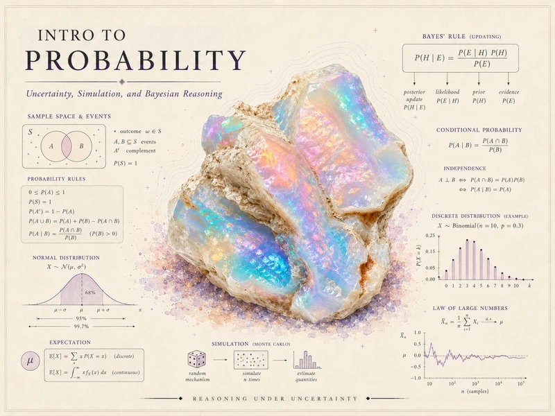

{srcset="assets/hero-web-800.webp 800w, assets/hero-web.webp 1400w" sizes="(min-width: 992px) 760px, 92vw" .course-hero-img fig-alt="Course identity banner for Introduction to Probability — an iridescent opal crystal surrounded by probability graphics: sample spaces and events, the probability rules, Bayes' rule, a binomial distribution, the normal curve, expectation, a Monte Carlo simulation sketch, and the law of large numbers, with the course title."}

# Introduction to Probability {.course-landing-title}

::: {.course-landing-subtitle}
Uncertainty, simulation, and Bayesian reasoning
:::

> Probability is the language we use to reason carefully when we do not — and cannot — know what
> will happen next. This course teaches you to speak it: to turn vague hunches about chance into
> precise statements, to update those statements as evidence arrives, and to check your reasoning
> by simulating the world on a computer.

## What this course is

This is a first course in probability, built around a simple promise: by the end, uncertainty will
feel less like a fog and more like a thing you can describe, compute with, and argue about. We start
from the classical foundations — sample spaces, events, and the rules that govern them — and build
steadily toward random variables, the standard distributions, and the limit behavior that makes
large-sample reasoning possible.

The course is deliberately **Bayesian-friendly**. Conditional probability and updating are not a
side topic tucked into one week; they sit near the center of how we think. When new information
arrives, a well-posed probability changes in a disciplined way, and learning that discipline is one
of the main things you will carry out of this course.

Throughout, we follow one small synthetic world — a commuter student's morning, with an unreliable
shuttle, the weather, a true/false quiz, and a stack of arriving buses. The same characters return
week after week as the machinery grows, so that each new idea attaches to something you already
understand rather than starting from scratch.

## What you will be able to do

By the end of the term, you should be able to:

- Set up a sample space and assign probabilities to events, and use the complement, addition, and
  multiplication rules without second-guessing them.
- Compute and interpret conditional probabilities, and decide whether two events are independent.
- Apply Bayes' rule to update a belief from a prior and evidence — and explain *why* a positive
  screening test can still leave a low probability of disease.
- Work with discrete and continuous random variables: their distributions, expectations, and
  variances, and the standard models (binomial, Poisson, exponential, normal).
- Describe how sums and averages behave — the law of large numbers and the central limit theorem —
  and *see* that behavior emerge in simulation.
- Build a small probability model of a real situation and defend the choices you made.

## How the site is organized

This public site has three working areas, reachable from the sidebar:

- **Notes** — the weekly instructional spine. Each week poses a question, develops the concept,
  works examples (including the recurring commuter case), names a common mistake, and offers
  ungraded self-checks. Start here.
- **Labs** — the simulation strand. Four short labs in R and Quarto let you confirm the theory by
  generating data and watching the patterns appear. Code is shown for study; you run it locally.
- **Resources** — a notation glossary, a one-page distribution reference, and setup instructions for
  R and Quarto. Keep these open while you read.

## Software

We use **R** (via RStudio or Posit Cloud) together with **Quarto** for the simulation work. The
software is a *support* for probability reasoning, not the center of the course: simulation lets you
check an answer you derived by hand, and build intuition for results that are hard to picture. No
prior coding experience is assumed — every lab is scaffolded, and the code is explained as it goes.
In the notes and labs here, R chunks are **shown as teaching examples** and are
not executed in place; you run them in your own session.

## Source and attribution

These notes are the course's own synthesis, grounded in but not copied from established sources:

- **Primary spine:** *Introduction to Probability* by Charles M. Grinstead and J. Laurie Snell, a
  free text released under the **GNU Free Documentation License**. It grounds our scope, sequence,
  and notation level.
- **Supplement:** **MIT OpenCourseWare 18.05**, *Introduction to Probability and Statistics*
  (**CC BY-NC-SA 4.0**), cited selectively for Bayesian reasoning, models, simulation, and review.
- **Optional orientation:** E. T. Jaynes, *Probability Theory: The Logic of Science*, cited only for
  the one-line idea that probability can be read as *extended logic* — quantified reasoning under
  uncertainty. Nothing from it is reproduced.

All examples use synthetic data with seeds set. The prose here is original.

## A note on what is public here

Everything on this site is **public and ungraded** — study material only. You will not find graded
prompts, answer keys, point values, or due dates here. The operational side of the course — graded
checkpoints, quizzes, homework, labs, the midterm, the project, and the final, along with all dates
and submissions — lives in **Blackboard (the LMS)**, which is authoritative. If this site and
Blackboard ever disagree, follow Blackboard.

::: {.callout-note}
## Draft course site

This site is a **draft course site**, not a finished release. Some pages are drafts,
formulas are provisional pending review, and no accessibility-compliance claim is made. Treat it as a
work in progress rather than the final word.
:::
