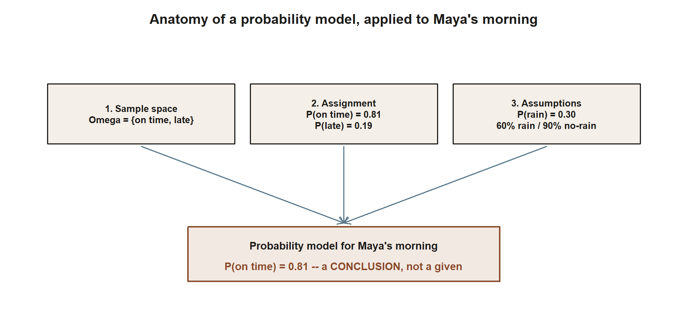
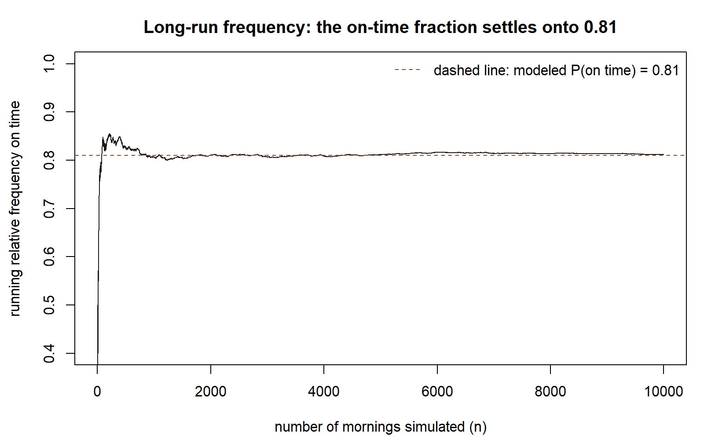

## The week question

When a transit app reports that the campus shuttle has an **81% chance of arriving on time**, what does
that number actually *say*? It looks like a fact about tomorrow morning, but tomorrow morning the shuttle
will either be on time or it will not — there is no "81%" you can point to in the world once the morning
happens. So the number must be describing something other than a single morning. This week we pin down what
it describes, why two perfectly reasonable people can mean different things by it, and how we package that
meaning into a small, explicit object called a **probability model**.

The thread we will pull all term starts here. Meet **Maya**, a commuter student who rides that shuttle to
an early class. Her recurring question — "Will I make it on time?" — is the seed from which sample spaces,
conditional probability, Bayes' rule, random variables, and simulation will all grow in later weeks. This
week we do not yet *compute* the 0.81; we learn to *read* it.

## Why this matters

Probability is the language we use to reason carefully when we do not know what will happen. That covers an
enormous amount of life and science: a weather forecast, a medical screening result, the reliability of a
machine, the outcome of an election, the next value in a noisy measurement. In every one of these, someone
has taken a vague feeling — "probably," "unlikely," "a good chance" — and replaced it with a number that
obeys consistent rules. The payoff is that numbers can be combined, checked for contradictions, and updated
when new information arrives; vague feelings cannot.

But a number is only as trustworthy as the **model** behind it. The same headline "81%" can rest on a long
record of past mornings, on someone's judgment, or on a chain of assumptions stitched together. If you do
not know which, you cannot know how much to lean on it. Learning to ask "what model produced this number,
and what did it assume?" is the single most transferable skill in this course. It is also what makes the
later, more technical weeks feel like *bookkeeping for a stance you already understand*, rather than a pile
of formulas.

## Learning goals

By the end of this week you should be able to:

- Read a probability statement such as $P(\text{on time}) = 0.81$ in **two ways** — as a long-run frequency
  and as a degree of belief — and say what each reading commits you to.
- Name the three ingredients of a **probability model**: a sample space, an assignment of probabilities, and
  the assumptions that justify the assignment.
- State the **informal axioms** every probability must satisfy ($0 \le P \le 1$, the whole space has
  probability $1$, disjoint events add, and the complement rule) and check a claimed number against them.
- Explain how a **simulation** turns the long-run-frequency picture into something literal you could watch
  on a screen, without yet writing or running the code.
- Identify the **hidden choices** — which event, which region, which time window — buried inside an everyday
  statement like "70% chance of rain."

## Core vocabulary

- **Outcome** $\omega$ — one fully specified way the situation could turn out (e.g. "the shuttle is on time
  this morning").
- **Sample space** $\Omega$ — the set of all outcomes we are willing to consider. Choosing it is a modeling
  decision, not a fact handed to us.
- **Event** — a collection of outcomes we care about, written with a capital letter such as $A$. "The
  shuttle is on time" is an event; so is its opposite.
- **Probability** $P(A)$ — a number we attach to an event, meant to measure how strongly it is expected,
  subject to the rules below. We always write $P(\cdot)$, never $\Pr(\cdot)$.
- **Complement** $A^{c}$ — the event that $A$ does **not** happen. ("Not on time" is the complement of "on
  time.")
- **Disjoint (mutually exclusive) events** — events that cannot both happen in the same outcome.
- **Probability model** — the package of sample space, probability assignment, and assumptions that together
  give every event of interest a number.
- **Long-run frequency** — the fraction of times an event happens if the situation were repeated many times
  under the same conditions.
- **Degree of belief** — a number expressing how confident a reasoner is in an event, given what they know.

All scenarios in these notes use **synthetic data; seed `35003` is set** wherever a simulation appears.

## Concept development

### Reading one number two ways

Take the headline $P(\text{on time}) = 0.81$. There are two honest, time-tested ways to read it, and they
answer different questions.

The **long-run-frequency** reading says: *if Maya rode this shuttle on a large number of similar mornings,
it would be on time about 81% of the time.* On this reading, the 0.81 is a property of a repeatable process.
It is checkable, at least in principle — keep a tally over a semester and compare. It is silent, though,
about *this* particular morning, which is a single, non-repeatable event.

The **degree-of-belief** reading says: *given everything I currently know — the season, the route, the
weather report — I am 81% confident the shuttle will be on time tomorrow.* On this reading, the 0.81 is a
considered judgment that could legitimately differ between two people who know different things, and that
*should* change when new information arrives. This is the reading that lets us talk sensibly about
one-off events that will never be repeated.

These two readings are not enemies. Much of the time they agree, and a good frequency record is exactly the
kind of evidence that *should* shape a reasonable degree of belief. The course is **Bayesian-friendly**: we
will lean on the degree-of-belief reading when we get to updating with new information (the engine of weeks
3–5), while never abandoning the frequency picture that keeps our beliefs honest. Holding both in mind is a
feature, not a confusion.

{#fig-wk01-two-readings fig-alt="Two side-by-side panels. Left, labeled long-run-frequency reading: repeat Maya's morning many times, then tally the fraction on time, landing on about 81% of many mornings. Right, labeled degree-of-belief reading: given what I know right now, state my confidence for this morning, landing on 81% confident, this one morning."}

::: {.callout-note appearance="minimal"}
**What the figure shows (non-visual equivalent).** The same number, $0.81$, sits at the bottom of two
different chains of reasoning: one about *many* repeated mornings (a tallied fraction), one about *this*
single morning (a stated confidence). Neither chain is "the real one" — the course uses both, leaning on the
degree-of-belief reading once updating begins in Weeks 3–5.
:::

There is a third, deeper way to phrase the degree-of-belief stance, due to E. T. Jaynes: probability is
**extended logic** — a consistent way to reason from incomplete information that reduces to ordinary
true/false logic when you happen to be certain. We only *name* this idea here; we will not develop it. It is
worth knowing that the rules we are about to write down can be motivated as "the unique consistent way to
score plausibility," not merely as "the math of coin flips."

### What a probability model is

A single number floating free is not yet probability; it becomes probability only inside a **model**. A
probability model has three parts, and naming them is the habit this whole course tries to build.

1. **A sample space $\Omega$** — the menu of outcomes you have decided to consider. For Maya's morning, the
   simplest menu is just $\Omega = \{\text{on time}, \text{late}\}$. A richer menu might also track whether
   it rained, or how many minutes late. The menu is *chosen*; a different question deserves a different menu.
2. **An assignment of probabilities** — a rule giving each event a number. For the simplest menu,
   $P(\text{on time}) = 0.81$ and $P(\text{late}) = 0.19$.
3. **The assumptions that justify the assignment** — the often-invisible third part. Where did 0.81 come
   from? In our running world it is *assembled*: it rests on the assumptions that it rains about 30% of
   mornings, that the shuttle runs on time 60% of rainy mornings and 90% of dry ones, and that those two
   sub-models combine in a particular way. We will do that assembly carefully in weeks 2–3. For now the
   point is only that **0.81 is a conclusion, not a given** — it inherits the trustworthiness of its
   assumptions.

Write a model down and a vague forecast becomes an auditable claim. You can ask whether the sample space
left anything out, whether the numbers are internally consistent, and whether the assumptions are
defensible. A number with no model behind it offers nowhere to put those questions.

{#fig-wk01-model-anatomy fig-alt="Three boxes across the top labeled 1 sample space (on time, late), 2 assignment (P on time 0.81, P late 0.19), and 3 assumptions (P rain 0.30; 60 percent rain, 90 percent no-rain), each with an arrow converging down into a single bottom box reading probability model for Maya's morning, P on time equals 0.81, a conclusion not a given."}

::: {.callout-note appearance="minimal"}
**What the figure shows (non-visual equivalent).** The bottom box's number, $0.81$, is not typed in by hand
— it is what falls out once you fix the top three boxes (the outcomes you are willing to consider, the
numbers you assign them, and the assumptions that justify those numbers). Change any one of the three top
boxes and the bottom number can change with it. *Figure is a course-original diagram; no data.*
:::

### The rules every probability obeys

Whatever reading you favor, the numbers have to play by a few rules, or they will contradict themselves.
Here they are in plain form (we will treat them more formally in Week 2):

- **Bounds.** Every probability lives between 0 and 1:
  $$ 0 \le P(A) \le 1. $$
  Zero means "ruled out," one means "certain," and the in-between values are the interesting cases.
- **Total.** The whole sample space is certain to occur, so it carries all the probability:
  $$ P(\Omega) = 1. $$
- **Addition for disjoint events.** If $A$ and $B$ cannot happen together, the chance that *one or the
  other* happens is the sum:
  $$ P(A \cup B) = P(A) + P(B) \qquad \text{when } A \cap B = \varnothing. $$
- **Complement.** Because $A$ and $A^{c}$ are disjoint and together fill $\Omega$, their probabilities must
  total one, which gives the most-used shortcut in the subject:
  $$ P(A^{c}) = 1 - P(A). $$

These four are not arbitrary bookkeeping; they are exactly what is needed for the numbers to never
contradict each other. If someone tells you an event has probability $1.3$, or that two opposite outcomes
have probabilities summing to $0.8$, you do not need to know anything about shuttles to know the model is
broken. That self-checking power is the reason we insist on the rules from day one.

### Simulation: the long-run picture, made literal

The frequency reading invites an obvious experiment: *repeat the morning many times and watch the fraction
on time settle down.* In the real world we cannot replay a morning, but inside a model we can — that is what
**simulation** is. We tell the computer the model's numbers, ask it to "live" thousands of synthetic
mornings, and tally how often the shuttle was on time. The tallied fraction should hover near the model's
0.81, and hover *more tightly* as the number of mornings grows. Seeing that convergence on a screen is the
frequency interpretation made literal.

We will not run code this week — the first simulation lab pairs with Week 2 — but it helps to see the shape
of the idea now. The chunk below is **shown as teaching, not executed**; the `#| eval: false` marker means
the page does not run it. If you paste it into your own R session later, the `set.seed(35003)` line makes
your numbers match a classmate's exactly.

```{r}
#| label: shuttle-frequency-sketch
#| eval: false

# Synthetic illustration; seed set so it is reproducible.
# Treat each morning as "on time" with the model's probability 0.81.
set.seed(35003)

p_on_time <- 0.81
n_mornings <- 10000

# rbinom draws 0/1 "on time" flags, one per simulated morning.
mornings <- rbinom(n = n_mornings, size = 1, prob = p_on_time)

# The running fraction on time should drift toward 0.81 as n grows.
running_fraction <- cumsum(mornings) / seq_len(n_mornings)

running_fraction[c(10, 100, 1000, 10000)]   # snapshots at growing n
mean(mornings)                              # overall simulated P(on time) ~ 0.81
```

Read it as a story, not as syntax to memorize: each simulated morning is an "on time / late" flip weighted
81-to-19; the running fraction is the tally-so-far; and the early snapshots are jumpy while the late ones
sit close to 0.81. That settling-down is not magic — it is the long-run-frequency reading happening in front
of you, and it previews the law of large numbers we make precise in Week 13.

{#fig-wk01-converge fig-alt="A line plot of the running relative frequency of on-time mornings against the number of mornings simulated, from 1 to 10,000. The line swings widely for the first hundred or so mornings, then flattens and hugs a dashed horizontal reference at 0.81."}

::: {.callout-note appearance="minimal"}
**What the figure shows (non-visual equivalent).** In this synthetic run the on-time fraction is about
$0.84$ after $100$ mornings, about $0.81$ after $1{,}000$, and about $0.81$ after $10{,}000$ — closing in on
the modeled $0.81$ as the run grows. *Figure generated from the course's own synthetic simulation; the
numbers are illustrative.*
:::

## Worked examples

### Worked example — reading the shuttle headline (the recurring slice)

**Symbolic first.** Let $A$ be the event "the shuttle is on time." A probability model for Maya's simplest
morning is the sample space $\Omega = \{\text{on time}, \text{late}\}$ together with an assignment
$P(A)$ and $P(A^{c})$. The rules force a relationship between them: since "on time" and "late" are disjoint
and exhaust $\Omega$,
$$ P(A) + P(A^{c}) = P(\Omega) = 1, \qquad \text{so} \qquad P(A^{c}) = 1 - P(A). $$

**Now numeric.** The headline gives $P(A) = 0.81$. The complement rule immediately yields
$$ P(\text{late}) = P(A^{c}) = 1 - 0.81 = 0.19. $$
Check the rules: both numbers lie in $[0,1]$, and $0.81 + 0.19 = 1.00$, so the assignment over the whole
space is consistent. (Data are synthetic; seed set.)

{#fig-wk01-complement-bar fig-alt="A single horizontal bar spanning 0 to 1. The left 81 percent of the bar is labeled on time, P(A) equals 0.81; the right 19 percent is labeled late, 0.19; a dashed line at 1.00 marks the total."}

::: {.callout-note appearance="minimal"}
**What the figure shows (non-visual equivalent).** The bar's two pieces are exactly the two numbers from the
arithmetic above, $0.81$ and $0.19$, drawn so that "both in $[0,1]$" and "sum to $1.00$" are visible at a
glance rather than only checked by addition.
:::

Now read the 0.81 both ways. **Frequency:** over a long run of similar mornings, expect on-time arrivals
about 81% of the time and late ones about 19%. **Degree of belief:** given what we know this morning, we are
81% confident in an on-time arrival. Notice what the simple model does *not* yet tell us: it says nothing
about *why* — it hides the rain. The fuller model behind the number assumes rain on about 30% of mornings,
with the shuttle on time 60% of the time when it rains and 90% when it does not, which combine to
$$ P(\text{on time}) = 0.60\,(0.30) + 0.90\,(0.70) = 0.18 + 0.63 = 0.81. $$
We are not assembling that here — that careful combination is the work of weeks 2–3 — but it shows concretely
that **0.81 is a conclusion riding on assumptions**, exactly as the model framing promised.

### Worked example — a "70% chance of rain" forecast (transfer)

**Symbolic first.** Let $R$ be the event named by a forecast, with $P(R) = 0.70$. The same machinery
applies: $R$ and $R^{c}$ are disjoint and fill the sample space, so
$$ P(\text{no rain}) = P(R^{c}) = 1 - P(R). $$

**Now numeric.** With $P(R) = 0.70$ we get $P(R^{c}) = 1 - 0.70 = 0.30$, and $0.70 + 0.30 = 1$ checks out.
So far this is identical to the shuttle case — the *same model machinery*, a different label on the event.

The transfer lesson is in the **hidden choices** the tidy number conceals. "70% chance of rain" only means
something once you fix three things that the headline leaves unstated:

- **Which event** counts as "rain"? Any measurable precipitation, or at least a set amount? A trace at dawn
  and a 70%-confident forecast are not the same claim.
- **Which region**? Rain *somewhere* in the county is a different event from rain *at the bus stop*.
- **Which time window**? "Today," "this afternoon," or "the next hour" name different events with different
  probabilities.

{#fig-wk01-rain-hidden-choices fig-alt="A top box reading P of R equals 0.70 with three arrows fanning down to three boxes: which event, any precipitation versus a measurable amount; which region, somewhere in the county versus at the bus stop; which time window, today versus this afternoon versus the next hour. A bottom box states that different choices name different events, so the same 70 percent can be different claims."}

::: {.callout-note appearance="minimal"}
**What the figure shows (non-visual equivalent).** The single number $0.70$ sits above three branch points;
picking a different answer at any one branch — event, region, or time window — changes which event the 70%
is actually a probability *of*, even though the headline digits never change.
:::

Two forecasters quoting "70%" can therefore be making genuinely different claims, just as our two readings
of 0.81 answered different questions. The discipline is the same one this whole week is about: before you
trust a probability, recover the model — *what event, over what space, under what assumptions?* (Forecast
figures here are illustrative and synthetic; seed set.)

## A common mistake

The most common Week 1 slip is treating a probability as a **prediction about the single next instance**, and
then judging the model by that one instance. "The app said 81% and the shuttle was late — so it was wrong."
Not so. A probability of 0.81 is entirely compatible with a late morning; in fact, late mornings *should*
happen about 19% of the time, and a model that never allowed them would be the broken one. A single outcome
can rarely confirm or refute a probability. What you check instead is the *long run* (does on-time happen
about 81% of the time over many mornings?) or the *coherence* (do the numbers obey the rules and rest on
defensible assumptions?).

{#fig-wk01-common-mistake fig-alt="A strip of 20 small rectangles in a row, one per simulated morning, colored by outcome: 11 on time, 9 late, in no particular pattern. A callout over one late rectangle near the middle reads: a late morning here does not mean the 0.81 model was wrong."}

::: {.callout-note appearance="minimal"}
**What the figure shows (non-visual equivalent).** In this particular synthetic run of 20 mornings, 11 were
on time and 9 were late — a run-fraction of $0.55$, well below the modeled $0.81$. That is exactly the "early
wobble" named in Concept development: short runs are noisy, and a handful of late mornings here is not
evidence the model is wrong. *Figure generated from the course's own synthetic simulation (seed 35003); the
count is a property of this one run, reported as-is, not smoothed toward 0.81.*
:::

A close cousin of this mistake is forgetting that **0 and 1 are special**: $P(A)=0$ should mean genuinely
ruled out and $P(A)=1$ genuinely certain. Reserve them for events you truly mean to call impossible or sure.
Sprinkling 0s and 1s onto merely-unlikely or merely-likely events quietly hard-codes assumptions you would
not defend out loud.

## Low-stakes self-checks (ungraded)

Use these to test your reading of this week. They are practice only — nothing here is collected or scored.

1. A model gives $P(\text{on time}) = 0.81$. Without any new computation, what is $P(\text{late})$, and
   which rule did you use?
2. Put the 0.81 into words **twice** — once as a long-run frequency and once as a degree of belief. What
   question does each version answer?
3. Someone claims an event has probability $1.2$. Which informal axiom does that violate, and how can you
   tell *without* knowing what the event is?
4. Name the three parts of a probability model for "rain at the bus stop tomorrow," and identify one
   assumption you would want to see stated.
5. In the shown simulation sketch, why would you expect the running fraction at $n = 10000$ to sit closer to
   0.81 than the running fraction at $n = 10$?
6. For "70% chance of rain," write down one event-definition choice, one region choice, and one time-window
   choice that would change what the 70% means.

## Reading and source pointer

This week pairs with both course texts:

- **Grinstead & Snell, *Introduction to Probability*, Chapter 1 — Discrete Probability Distributions.** Read
  it for the idea of attaching probabilities to outcomes and for the basic rules those probabilities obey.
  Free online:
  <https://www.dartmouth.edu/~chance/teaching_aids/books_articles/probability_book/book.html>.
- **MIT OpenCourseWare 18.05, *Introduction to Probability and Statistics* — the introductory material on
  probability models and the interpretation of probability.** Use it for a second, complementary take on what
  a probability *means* and on the modeling stance. Free online:
  <https://ocw.mit.edu/courses/18-05-introduction-to-probability-and-statistics-spring-2022/>.
- The "probability as **extended logic**" framing is associated with E. T. Jaynes, *Probability Theory: The
  Logic of Science*; it is cited here for orientation only and is not required reading.

These notes are the course's own synthesis, grounded in but not copied from the sources.

## Public vs. graded

These notes, the examples, and the practice here are **public and ungraded** — study material only. No
graded prompts, answer keys, rubrics, point values, or due dates appear on this site. Graded checkpoints,
quizzes, homework, labs, the midterm, the project, and the final live in **Blackboard (the LMS)**, which is
authoritative for due dates, submissions, and grades. If this page and Blackboard ever disagree, follow
Blackboard.

## Looking ahead

Next week we build the sample space honestly. Maya's morning grows from the two-outcome menu into a
**shuttle × rain** sample space, and we put the complement and addition rules to work on real events — the
first step in *assembling* the 0.81 instead of taking it as a given. That assembly continues into Week 3,
where the rainy-morning and dry-morning shuttle rates ($0.60$ and $0.90$) become our first taste of
**conditional probability**. The first hands-on simulation lab also arrives with Week 2, turning this week's
"shown but not run" sketch into something you execute yourself.

## See also

- [Week 2 — Sample spaces, events & rules](week-02-sample-spaces-events-rules.qmd) — where the 0.81 starts to
  get assembled, and the rules above are applied to real events.
- [Notation glossary](../resources/notation-glossary.qmd) — the binding symbols ($\Omega$, $A^{c}$, $P(A)$,
  and the rest) used across the course.
- [Distribution reference](../resources/distribution-reference.qmd) — the parameter conventions we will adopt
  once named distributions enter the picture.
- [Course syllabus](../syllabus.qmd) — schedule, policies, and how the public site relates to Blackboard.
