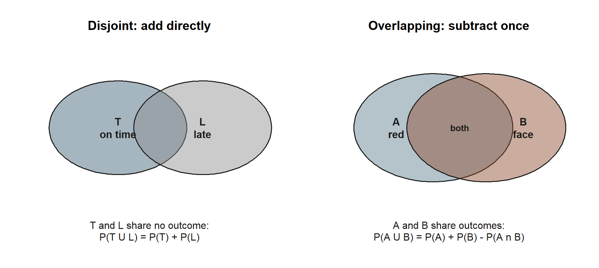
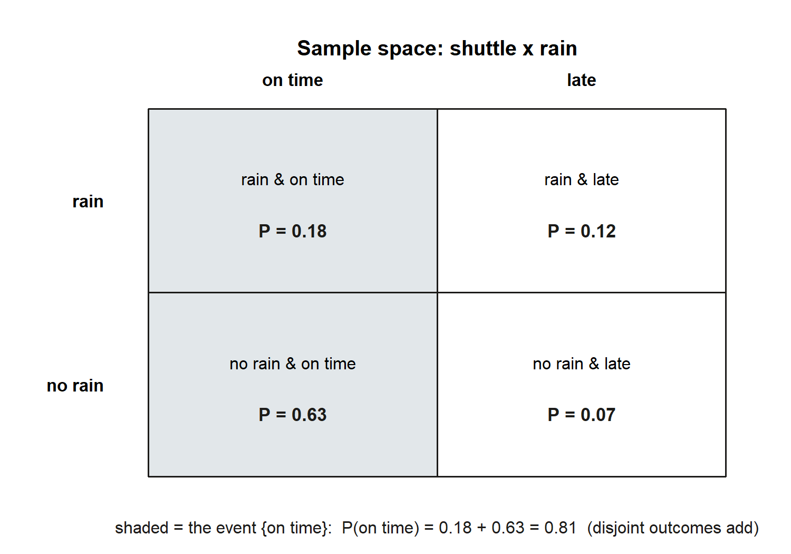
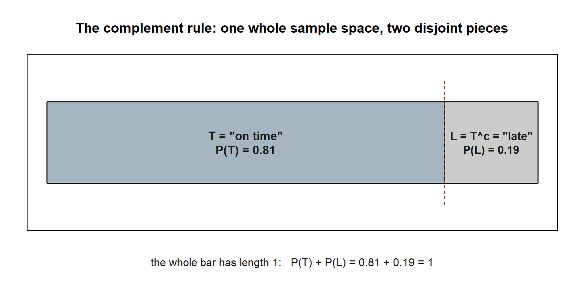
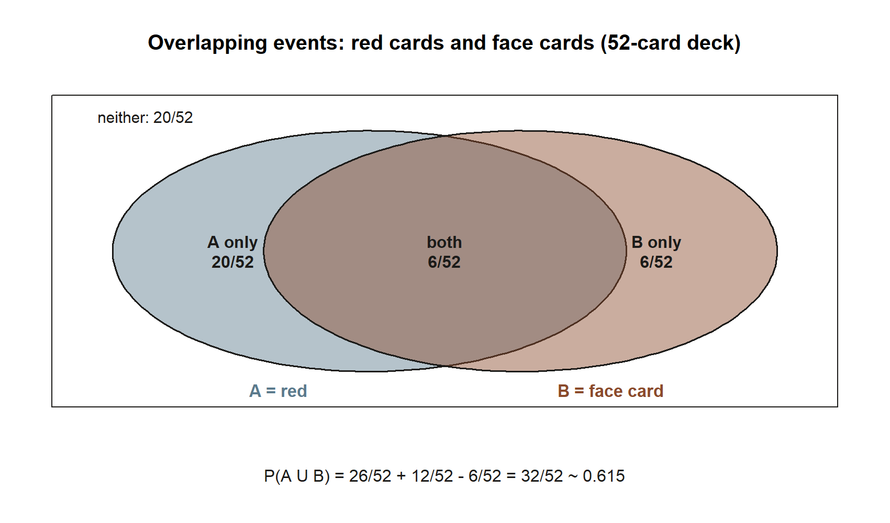
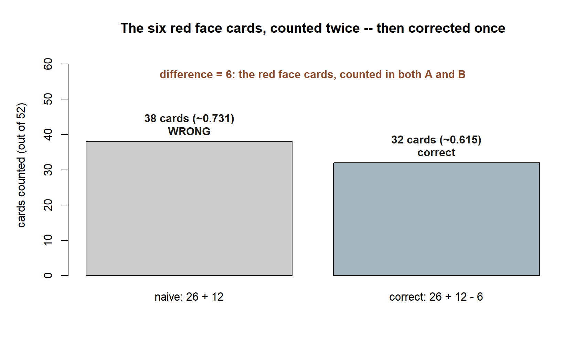

## The week question

Last week we said the number $0.81$ — the probability that Maya's morning shuttle is on time — *means*
something about the long run. This week we ask the next question: **once we have a list of everything that
could happen, how do we build new probabilities from old ones without re-counting from scratch?**

If you know that the shuttle is on time $81\%$ of mornings, you should not have to do any new bookkeeping to
say how often it is *late*. And if you want the chance of "rain **or** a late shuttle," you should be able to
assemble it from pieces you already have. The machinery for this is small but exact: write down the **sample
space**, name the outcomes you care about as **events**, and then combine events with two rules — the
**complement rule** and the **addition rule**. Get the list right and the rest is arithmetic.

## Why this matters

Almost every probability you will ever compute is really a statement about a *set* of outcomes. "The shuttle
is late," "I draw a red card," "at least one of two emails is spam" — each names a collection of possible
results, and the probability is how much of the whole that collection covers. Once you see events as sets,
two facts become unavoidable. First, every outcome either is or is not in your event, so the chance of "not
$A$" is just whatever is left over: that is the complement rule, and it turns hard questions ("at least one")
into easy ones ("none"). Second, when you glue two events together with "or," you must not double-count the
overlap — that single correction, inclusion–exclusion, is the source of more right answers than almost any
other rule in the course.

These are also the rules that make later weeks possible. Conditional probability (Week 3), independence
(Week 4), and Bayes' rule (Week 5) are all built on unions, intersections, and complements. If the set
picture is solid now, the rest of the term is mostly careful application of it.

## Learning goals

By the end of this week you should be able to:

- Write down the **sample space** $\Omega$ for a small experiment and list its outcomes explicitly.
- Express an **event** as a subset of $\Omega$ and read its probability as the total of the outcomes it
  contains.
- Apply the **complement rule** $P(A^{c}) = 1 - P(A)$ and explain *why* it must hold.
- Use the **addition rule** for disjoint events, and the **general inclusion–exclusion** rule
  $P(A \cup B) = P(A) + P(B) - P(A \cap B)$ when events overlap.
- Decide, from the wording of a problem, whether two events are disjoint (so the overlap term is zero) or
  overlapping (so it is not).
- Tie a coarse model (on-time vs. late) back to a finer one (rain vs. no-rain crossed with on-time vs. late)
  and check that the two agree.

## Core vocabulary

- **Sample space ($\Omega$).** The set of all outcomes of an experiment that we treat as possible, listed so
  that exactly one of them occurs on any single run.
- **Outcome ($\omega$).** A single element of $\Omega$ — one complete result of the experiment.
- **Event ($A$, $B$, $E$).** A subset of $\Omega$. The event "happens" exactly when the outcome that occurs
  is one of its members. Its probability is the total probability of the outcomes it contains.
- **Complement ($A^{c}$).** The event "$A$ does not happen" — every outcome of $\Omega$ that is *not* in $A$.
  We write $A^{c}$ throughout this course (not $A'$ and not $\bar A$).
- **Union ($A \cup B$).** The event "$A$ **or** $B$ (or both)." Our "or" is always **inclusive**: outcomes in
  both events still count.
- **Intersection ($A \cap B$).** The event "$A$ **and** $B$" — the outcomes that belong to both events at once.
- **Disjoint (mutually exclusive) events.** Two events with no outcome in common: $A \cap B = \varnothing$.
  They cannot both occur on the same run.

A note that will matter in Week 4: "disjoint" is *not* the same as "independent." Disjoint events are about
sharing no outcomes; independence is about one event carrying no information about the other. Keep them apart.

## Concept development

### From an experiment to a sample space

A probability model starts with a clean list of what could happen. Consider Maya's morning as a small
two-part experiment: first the weather is either rain or no rain, and then the shuttle is either on time or
late. Crossing the two parts gives four complete outcomes, and that set is the sample space:

$$
\Omega = \{\,(\text{rain},\,\text{on time}),\ (\text{rain},\,\text{late}),\
(\text{no rain},\,\text{on time}),\ (\text{no rain},\,\text{late})\,\}.
$$

Each $\omega \in \Omega$ is one full description of the morning. Exactly one of the four occurs on any given
day, and together they exhaust the possibilities — that is what makes this a legitimate sample space. The
four outcomes are **not** equally likely (rainy mornings are rarer, and the shuttle behaves differently in
the rain), so we attach a probability to each rather than counting $1/4$ apiece.

The recipe behind that crossing step is general, not specific to weather and shuttles: whenever an
experiment runs in two stages, you cross every outcome of stage 1 with every outcome of stage 2, and the
sample space is the full set of pairs.

{#fig-wk02-two-stage fig-alt="A tree diagram: a start node splits into two stage-1 branches labeled a and b; each of those splits again into two stage-2 branches labeled x and y, producing four leaf outcomes labeled (a,x), (a,y), (b,x), and (b,y)."}

::: {.callout-note appearance="minimal"}
**What the figure shows (non-visual equivalent).** A two-stage experiment has stage-1 outcomes $\{a, b\}$ and
stage-2 outcomes $\{x, y\}$; crossing them lists every complete outcome: $(a,x)$, $(a,y)$, $(b,x)$, $(b,y)$ —
four outcomes, exactly as many as (rain/no rain) crossed with (on time/late) gave above. No probabilities are
attached here; this is the *pattern*, not a worked answer. *Synthetic instructional example; numbers are illustrative.*
:::

### Events are subsets you can name in plain language

Any phrase that describes "what happened" picks out a subset of $\Omega$. Three useful ones for this week:

- Let $R$ = "it rains" $= \{(\text{rain},\,\text{on time}),\ (\text{rain},\,\text{late})\}$.
- Let $T$ = "the shuttle is on time" $= \{(\text{rain},\,\text{on time}),\ (\text{no rain},\,\text{on time})\}$.
- Let $L$ = "the shuttle is late" $= \{(\text{rain},\,\text{late}),\ (\text{no rain},\,\text{late})\}$.

Notice that $T$ and $L$ share no outcomes: $T \cap L = \varnothing$. They are **disjoint** — the shuttle
cannot be both on time and late on the same morning. Notice also that $L$ is exactly "everything in $\Omega$
that is not in $T$," which is the set-language way of saying $L = T^{c}$. That single observation is the
whole point of the complement rule, coming next.

### The complement rule

Because every outcome is either in $A$ or in $A^{c}$ and never in both, the probabilities of an event and its
complement must account for the entire sample space. The probability of all of $\Omega$ is $1$, so

$$
P(A) + P(A^{c}) = 1 \qquad\Longrightarrow\qquad P(A^{c}) = 1 - P(A).
$$

This is the most quietly useful rule in the course. Many questions are awkward head-on but easy through the
back door: "at least one" is the complement of "none," and "late" is the complement of "on time." When the
direct count is messy, ask whether the *opposite* is simpler, compute that, and subtract from $1$.

### The addition rule and inclusion–exclusion

To find the probability of "$A$ or $B$," you might be tempted to add $P(A)$ and $P(B)$. That is correct only
when the two events are **disjoint** — when they share no outcome, nothing gets counted twice:

$$
P(A \cup B) = P(A) + P(B) \qquad\text{if } A \cap B = \varnothing.
$$

When the events *do* overlap, adding $P(A)$ and $P(B)$ counts every shared outcome once in $P(A)$ and again
in $P(B)$. To correct the double count, subtract the overlap exactly once. This is the **general addition
rule**, or **inclusion–exclusion**:

$$
P(A \cup B) = P(A) + P(B) - P(A \cap B).
$$

The disjoint version is just the special case where $P(A \cap B) = 0$, so you can keep only the general rule
in mind and let the overlap term vanish when there is no overlap. The discipline is simple to state and easy
to forget under time pressure: **whenever you see "or," check for the overlap before you add.**

{#fig-wk02-addition-compare fig-alt="Two side-by-side diagrams. Left: two circles labeled T (on time) and L (late) drawn as touching but not overlapping, captioned P(T union L) = P(T) + P(L). Right: two overlapping circles labeled A (red) and B (face card) with a shared middle region labeled both, captioned P(A union B) = P(A) + P(B) minus P(A intersect B)."}

::: {.callout-note appearance="minimal"}
**What the figure shows (non-visual equivalent).** The picture is the test you should run on every "or"
question: can a single outcome belong to both named events? If no (left, disjoint), add the two probabilities
straight across. If yes (right, overlapping), add them and then subtract the shared probability once. Both
worked examples below use one side of this picture. *Synthetic instructional example; numbers are illustrative.*
:::

{#fig-wk02-space fig-alt="A two-by-two grid of the shuttle-by-rain sample space. Rows are rain and no rain; columns are on time and late. The cells read: rain and on time P = 0.18, rain and late P = 0.12, no rain and on time P = 0.63, no rain and late P = 0.07. The on-time column is shaded."}

::: {.callout-note appearance="minimal"}
**What the figure shows (non-visual equivalent).** The event {on time} is the union of two disjoint outcomes
— (rain, on time) with probability $0.18$ and (no rain, on time) with probability $0.63$ — so by the addition
rule for disjoint events $P(\text{on time}) = 0.18 + 0.63 = 0.81$. The four cell probabilities sum to $1$.
*Synthetic instructional example; numbers are illustrative.*
:::

## Worked examples

### Worked example — the shuttle's complement, and tying $0.81$ to a finer model

**Symbolic.** We want $P(L)$, the probability the shuttle is late. We saw that "late" is the complement of
"on time," $L = T^{c}$, so the complement rule applies directly:

$$
P(L) = P(T^{c}) = 1 - P(T).
$$

**Numeric.** From the running model, the marginal probability the shuttle is on time is $P(T) = 0.81$.
Therefore

$$
P(L) = 1 - 0.81 = 0.19.
$$

So Maya's shuttle is late on about $19\%$ of mornings. We did **no** new counting — the $0.19$ fell straight
out of the $0.81$ we already had.

{#fig-wk02-complement fig-alt="A single horizontal bar split into two segments. The left segment, about four-fifths of the bar, is labeled T, on time, P(T) = 0.81. The right segment, the remaining one-fifth, is labeled L equals T complement, late, P(L) = 0.19."}

::: {.callout-note appearance="minimal"}
**What the figure shows (non-visual equivalent).** $T$ and $L$ split the entire sample space with nothing
left over and nothing shared, so their probabilities are two pieces of the same whole: $P(T) + P(L) =
0.81 + 0.19 = 1$. That is the complement rule with no arithmetic left to do beyond subtraction. *Synthetic instructional example; numbers are illustrative.*
:::

It is worth seeing *where* the coarse number $0.81$ comes from, because it ties the two-outcome picture
(on time / late) back to the four-outcome sample space (rain $\times$ on-time). In the finer model, the
shuttle's reliability depends on the weather: it is on time on $60\%$ of rainy mornings and $90\%$ of dry
ones, and it rains on $30\%$ of mornings. Splitting "on time" across the two weather cases and adding the
disjoint pieces gives

$$
P(T) = \underbrace{0.60 \times 0.30}_{\text{on time and rain}}
     + \underbrace{0.90 \times 0.70}_{\text{on time and no rain}}
     = 0.18 + 0.63 = 0.81.
$$

The two slices "on time and rain" and "on time and no rain" are disjoint, so we *added* them with no overlap
correction — the disjoint addition rule doing quiet work inside the finer model. The coarse $0.81$ and the
fine breakdown agree, and the complement rule then hands us $P(L) = 0.19$ either way. (We return to the
$0.60 \times 0.30$ piece as a *conditional* probability in Week 3; for now read it as the share of all
mornings that are both rainy and on time.) *Synthetic data; seed 35003 set.*

### Worked example — drawing one card: $P(\text{red or face card})$

For a transfer to a new context, leave the shuttle behind and draw a single card from a standard
$52$-card deck, every card equally likely. Let

- $A$ = "the card is **red**" (hearts or diamonds), and
- $B$ = "the card is a **face card**" (jack, queen, or king of any suit).

**Symbolic.** The events overlap — a card can be both red and a face card — so we need the full
inclusion–exclusion rule:

$$
P(A \cup B) = P(A) + P(B) - P(A \cap B).
$$

**Numeric.** Count outcomes out of $52$:

- Red cards: $26$ of the $52$, so $P(A) = \dfrac{26}{52} = \dfrac{1}{2}$.
- Face cards: $3$ ranks $\times\ 4$ suits $= 12$, so $P(B) = \dfrac{12}{52} = \dfrac{3}{13}$.
- Red **and** face: the red face cards are the jack, queen, and king of hearts and of diamonds — $2$ suits
  $\times\ 3$ ranks $= 6$, so $P(A \cap B) = \dfrac{6}{52} = \dfrac{3}{26}$.

Putting the pieces together,

$$
P(A \cup B) = \frac{26}{52} + \frac{12}{52} - \frac{6}{52} = \frac{32}{52} = \frac{8}{13} \approx 0.615.
$$

{#fig-wk02-card-venn fig-alt="Two overlapping ellipses inside a rectangle representing the 52-card deck. The left ellipse is labeled A, red; the right is labeled B, face card. The left-only region reads 20 of 52, the overlapping middle region reads both, 6 of 52, the right-only region reads 6 of 52, and text outside both ellipses reads neither, 20 of 52."}

::: {.callout-note appearance="minimal"}
**What the figure shows (non-visual equivalent).** Of the $52$ cards: $20$ are red only, $6$ are face cards
only, $6$ are both red and a face card, and the remaining $20$ are neither. Adding the "red" region ($26$)
and the "face" region ($12$) counts the shared $6$-card region twice, so inclusion–exclusion removes it once
to land on $32$ cards, $P(A \cup B) \approx 0.615$. *Synthetic instructional example; numbers are illustrative.*
:::

The overlap term is doing all the work: if you had carelessly added $26 + 12 = 38$ favorable cards you would
have reported $\tfrac{38}{52} \approx 0.731$, counting the six red face cards twice. Subtracting the
$6$-card overlap once brings the count down to the correct $32$ cards. Whenever an "or" question has events
that can both be true, the overlap is exactly what keeps the answer honest. *Synthetic framing; seed 35003
set (the deck makes this exactly computable, no random draw needed).*

You can see the same arithmetic by simulation; the companion lab does this with random draws.

```{r}
#| label: card-or-faceevent-counts
#| eval: false
# Shown as teaching, not executed in this build. Count the union directly
# from the 52-card deck, then check it against inclusion-exclusion.
set.seed(35003)

suits <- c("hearts", "diamonds", "clubs", "spades")
ranks <- c("A", "2", "3", "4", "5", "6", "7", "8", "9", "10", "J", "Q", "K")
deck  <- expand.grid(rank = ranks, suit = suits, stringsAsFactors = FALSE)

is_red  <- deck$suit %in% c("hearts", "diamonds")
is_face <- deck$rank %in% c("J", "Q", "K")

p_red       <- mean(is_red)              # 26/52
p_face      <- mean(is_face)             # 12/52
p_red_face  <- mean(is_red & is_face)    # 6/52  (the overlap)
p_red_or_face <- mean(is_red | is_face)  # 32/52, computed directly

# Inclusion-exclusion should reproduce the direct union:
p_red + p_face - p_red_face              # equals p_red_or_face
```

## A common mistake

The classic error this week is **adding probabilities of overlapping events as if they were disjoint** —
forgetting the $-\,P(A \cap B)$ term. It shows up the moment an "or" question involves two properties a single
outcome can share. In the card example, "red or face" tempts you to write $\tfrac{26}{52} + \tfrac{12}{52}$
and report $\approx 0.73$, but that double-counts the six red face cards. The fix is a habit, not a formula:
**every time you see "or," ask whether a single outcome can satisfy both events.** If it can, find the
overlap and subtract it once. If it genuinely cannot — as with "on time" versus "late," which no single
morning can both be — then the overlap is zero and plain addition is correct.

{#fig-wk02-overcount fig-alt="A two-bar chart. The left bar, labeled naive: 26 plus 12, reaches 38 cards, about 0.731, marked WRONG. The right bar, labeled correct: 26 plus 12 minus 6, reaches 32 cards, about 0.615, marked correct. A note above states the difference of 6 is the red face cards, counted in both A and B."}

::: {.callout-note appearance="minimal"}
**What the figure shows (non-visual equivalent).** The naive bar ($38$ cards, $\approx 0.731$) and the
correct bar ($32$ cards, $\approx 0.615$) differ by exactly the $6$ red face cards that the naive sum counted
twice — once inside "red," once inside "face card." Subtracting that overlap once is the entire fix.
*Synthetic instructional example; numbers are illustrative.*
:::

A smaller cousin of this mistake is applying the complement rule to the *wrong* whole. $P(A^{c}) = 1 - P(A)$
only works when $A$ and $A^{c}$ together make up the entire sample space. "On time" and "late" qualify; "rain"
and "on time" do not (they are neither complementary nor disjoint), so $1 - P(\text{rain})$ is *not* the
probability of being on time.

## Low-stakes self-checks (ungraded)

Use these to test yourself; they are practice only, with no points and nothing to submit.

1. Write the sample space for flipping a coin **twice**, listing all four outcomes. Then write the event
   "at least one head" as a subset, and find its probability using the complement rule (its complement is
   "no heads").
2. Using the shuttle model, you know $P(T) = 0.81$. Without any new counting, state $P(L)$ and explain in one
   sentence why the complement rule applies here but would *not* let you get $P(\text{no rain})$ from $P(T)$.
3. Draw one card. Find $P(\text{a club or a king})$ with inclusion–exclusion. (How many cards are both a club
   and a king? Subtract that overlap once.)
4. Two events satisfy $P(A) = 0.5$, $P(B) = 0.4$, and $P(A \cup B) = 0.7$. What is $P(A \cap B)$? Are $A$ and
   $B$ disjoint? How can you tell from the numbers alone?
5. In the four-outcome shuttle sample space, identify the two disjoint slices whose probabilities add to
   $0.81$, and confirm they sum correctly. Why was it legitimate to add them without an overlap term?

## Reading and source pointer

This week's spine reading is **Grinstead & Snell, *Introduction to Probability*, Chapter 1 (Discrete
Probability Distributions)** — it develops sample spaces, events as subsets, and the basic rules for
combining them, at exactly the level we use here. Read it for the set-theoretic picture of an event and for
its treatment of equally-likely outcomes (which the card example leans on, even though the shuttle example
deliberately does not). Free online:
<https://www.dartmouth.edu/~chance/teaching_aids/books_articles/probability_book/book.html>.

There is no MIT 18.05 pointer this week; we will bring 18.05 in starting in Week 3, where conditional
probability and base rates begin.

These notes are the course's own synthesis, grounded in but not copied from the sources.

## Public vs. graded

These notes, the examples, and the practice here are **public and ungraded** — study material only. No
graded prompts, answer keys, rubrics, point values, or due dates appear on this site. Graded checkpoints,
quizzes, homework, labs, the midterm, the project, and the final live in **Blackboard (the LMS)**, which is
authoritative for due dates, submissions, and grades. If this page and Blackboard ever disagree, follow
Blackboard.

## Looking ahead

We treated the $0.60$ and $0.90$ reliabilities as ingredients of the marginal $0.81$ without quite saying
what they *are*. They are **conditional probabilities** — the chance the shuttle is on time *given* the
weather — and they are the engine of the next three weeks. **Week 3** defines $P(A \mid B)$ and shows why
$P(\text{on time} \mid \text{rain}) = 0.60$ is a different, more informative number than the overall $0.81$.
**Week 4** asks whether knowing the weather changes the shuttle's chances at all (independence), and
**Week 5** runs the logic backward with Bayes' rule. Each is built on the unions, intersections, and
complements you assembled today.

## See also

- Companion lab: [Lab 2 — Monte Carlo basics](../labs/lab-02-monte-carlo-basics.qmd) — estimate these same
  probabilities by simulating many repetitions and watching the long-run fractions settle.
- [Notation glossary](../resources/notation-glossary.qmd) — the binding symbols for $\Omega$, $A^{c}$,
  $A \cup B$, $A \cap B$, and disjoint events.
- [Distribution reference](../resources/distribution-reference.qmd) — for later weeks, once events grow into
  random variables and named distributions.
- [Course syllabus](../syllabus.qmd) — schedule, policies, and where graded work lives.
- Next: [Week 3 — Conditional probability](week-03-conditional-probability.qmd).
