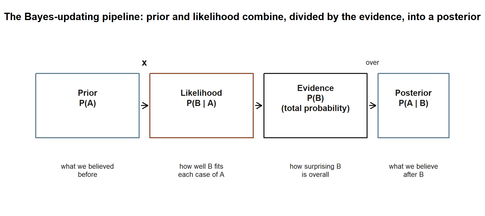
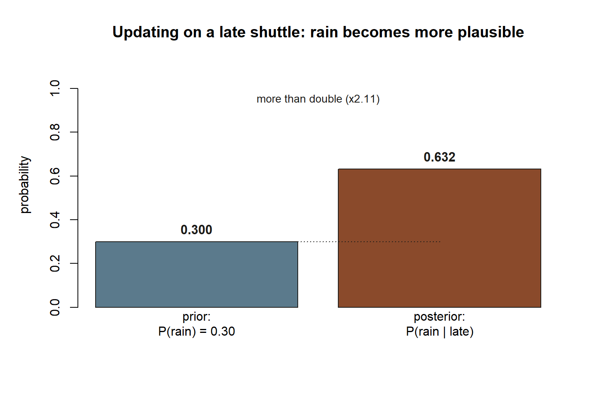

## Mathematical goal

This week we derive **Bayes' rule** and learn to read what it tells us. The goal is narrow and concrete:
starting only from the definition of conditional probability you already met in Week 3, build the formula
that lets you run a conditional probability *backwards* — to go from $P(B\mid A)$, which you can often
measure directly, to $P(A\mid B)$, which is what you usually want to know.

Two short symbolic moves do the whole job. First, the definition of conditional probability, written twice,
forces an identity for the joint probability $P(A\cap B)$. Second, the **law of total probability** rewrites
the denominator $P(B)$ as a weighted sum over the cases of $A$. Put the two together and Bayes' rule
appears. Along the way we name the four pieces — **prior**, **likelihood**, **evidence**, and **posterior**
— the vocabulary the rest of the course uses to talk about updating a belief in light of new information.

By the end you should be able to state Bayes' rule, derive it in two lines, expand the denominator with
total probability, and compute a posterior for a screening test. The headline lesson is the **base-rate
surprise**: a test that is right most of the time can still leave you more likely *not* to have the
condition, even after a positive result, when the condition is rare.

## The week question

> A screening test for some condition is positive. The test is good — it catches $95\%$ of true cases and
> correctly clears $90\%$ of people who do not have the condition. **Given a positive result, what is the
> probability the person actually has the condition?**

Most people answer "around $90\%$ or higher." When the condition is rare the honest answer is far lower —
and not because the test is bad. The *prior* probability of the condition was small to begin with, and a
single positive result moves us only so far. Bayes' rule is the machine that gets the number right. The same
machine answers a homier question from our running case: Maya's campus shuttle is **late** this morning —
how likely is it that it is **raining**? We will reverse "rain makes the shuttle late" into "lateness makes
rain more plausible," and put a number on how much more.

## Notation

| Symbol | Meaning |
|---|---|
| $P(A)$ | the **prior** probability of event $A$, before seeing the new evidence |
| $P(B\mid A)$ | the **likelihood** of the evidence $B$ if $A$ is true (read forward; $P(A)>0$) |
| $P(B)$ | the **evidence** (or marginal) — the overall probability of seeing $B$, $P(B)>0$ |
| $P(A\mid B)$ | the **posterior** probability of $A$ after seeing $B$ — what we want |
| $A^{c}$ | the complement of $A$ ("$A$ does not happen") |
| $P(A\cap B)$ | the joint probability that both $A$ and $B$ occur |
| $A_1,\dots,A_k$ | a partition of $\Omega$: disjoint cases that together cover everything |
| $\pi$ | prevalence — here the prior probability that a person has the condition |
| $D$, $D^{c}$ | "has the condition" and "does not have the condition" |
| $+$, $-$ | the test reads positive / negative |

These four named roles carry through the term: the **prior** $P(A)$ is "what we believed before," the
**likelihood** $P(B\mid A)$ is "how well the evidence fits each hypothesis," the **evidence** $P(B)$ is "how
surprising the data is overall," and the **posterior** $P(A\mid B)$ is "what we believe after." Keeping
these names straight is most of the battle.

## Conceptual setup

### From the definition of conditional probability to a joint identity

Recall the Week 3 definition. For events with positive probability,

$$
P(A\mid B) = \frac{P(A\cap B)}{P(B)}, \qquad P(B) > 0,
$$

and, reading the *other* conditional the same way,

$$
P(B\mid A) = \frac{P(A\cap B)}{P(A)}, \qquad P(A) > 0 .
$$

Both fractions have the **same numerator**, $P(A\cap B)$, because "$A$ and $B$ both happen" does not depend
on the order in which you name them. Multiply each equation through by its denominator and you get two
expressions for that one joint probability:

$$
P(A\cap B) = P(A\mid B)\,P(B) = P(B\mid A)\,P(A) .
$$

This single identity is the hinge of the whole week. It says the joint probability can be built two ways —
condition on $B$ first, or condition on $A$ first — and the two must agree.

### Reversing the conditioning

We usually *measure* one direction and *want* the other. A lab can estimate $P(+\mid D)$, the chance a sick
person tests positive, by testing many known-sick people. What a patient wants is $P(D\mid +)$, the chance
of being sick given a positive test. Set the two products from the identity equal and divide by $P(B)$:

$$
P(A\mid B) = \frac{P(B\mid A)\,P(A)}{P(B)} .
$$

That is **Bayes' rule** in its compact form: posterior equals likelihood times prior, divided by evidence.
It is exact — no approximation — and it follows from nothing but the definition of conditional probability
written in both directions.

### The law of total probability for the denominator

The compact form hides a practical problem: the denominator $P(B)$ is rarely handed to us directly. We
usually know $P(B)$ only *through the cases of $A$* — the likelihoods $P(B\mid A)$ and $P(B\mid A^c)$. The
**law of total probability** rebuilds $P(B)$ from exactly those pieces. If $A_1,\dots,A_k$ partition the
sample space (disjoint, and together all of $\Omega$), every occurrence of $B$ falls inside exactly one
case, so

$$
P(B) = \sum_{i=1}^{k} P(B\mid A_i)\,P(A_i) .
$$

For a yes/no hypothesis the partition is just $A$ and $A^c$, and the sum has two terms:

$$
P(B) = P(B\mid A)\,P(A) + P(B\mid A^c)\,P(A^c) .
$$

Substituting this denominator into Bayes' rule gives the **expanded form** we actually compute with:

$$
P(A\mid B) = \frac{P(B\mid A)\,P(A)}{P(B\mid A)\,P(A) + P(B\mid A^c)\,P(A^c)} .
$$

Read it slowly. The numerator is the weight on the path "$A$ is true *and* we saw $B$." The denominator is
the *total* weight on seeing $B$ at all, summed over both ways it could have happened. The posterior is the
numerator's share of that total. Bayes' rule is, in the end, bookkeeping: of all the ways the evidence could
have arisen, what fraction came through the hypothesis you care about?

Before applying the machine to numbers, it helps to see the whole pipeline in one picture: the prior and the
likelihood combine (multiply), and dividing by the evidence turns that combination into the posterior. The
two worked examples below both walk this exact same four-box path, just with different numbers in each box.

{#fig-wk05-pipeline fig-alt="A left-to-right flow diagram of four boxes connected by arrows: Prior P(A), Likelihood P(B given A), Evidence P(B) by total probability, and Posterior P(A given B). A multiplication sign sits between the first two boxes and a division label sits above the arrow into the last box."}

::: {.callout-note appearance="minimal"}
**What the figure shows (non-visual equivalent).** Four named quantities, read left to right: the prior
$P(A)$ ("what we believed before"), the likelihood $P(B\mid A)$ ("how well $B$ fits each case of $A$"), the
evidence $P(B)$ ("how surprising $B$ is overall," built by total probability), and the posterior $P(A\mid B)$
("what we believe after $B$"). The first two combine by multiplication; dividing that product by the evidence
gives the posterior — exactly the expanded formula above, drawn as a shape instead of written as a fraction.
:::

## Worked example

### Worked example — the screening test (the headline)

**Symbolic first.** Let $D$ be "has the condition" with prior (prevalence) $P(D) = \pi$, so
$P(D^c) = 1 - \pi$. The test has **sensitivity** $P(+\mid D)$ (it catches true cases) and **specificity**
$P(-\mid D^c)$ (it clears true non-cases). The piece Bayes needs is the *false-positive* likelihood, which
the specificity hands us by complement:

$$
P(+\mid D^c) = 1 - P(-\mid D^c) .
$$

The posterior we want is $P(D\mid +)$. Expanded Bayes gives

$$
P(D\mid +) = \frac{P(+\mid D)\,P(D)}{P(+\mid D)\,P(D) + P(+\mid D^c)\,P(D^c)} .
$$

**Now the numbers.** Our synthetic screening world (data are synthetic; seed set):

$$
\pi = P(D) = 0.02, \qquad P(+\mid D) = 0.95, \qquad P(-\mid D^c) = 0.90 .
$$

First the false-positive likelihood:

$$
P(+\mid D^c) = 1 - 0.90 = 0.10 .
$$

Next the evidence — the overall chance of a positive test — by total probability:

$$
P(+) = P(+\mid D)\,P(D) + P(+\mid D^c)\,P(D^c) = 0.95(0.02) + 0.10(0.98) = 0.019 + 0.098 = 0.117 .
$$

Finally the posterior:

$$
P(D\mid +) = \frac{0.95(0.02)}{0.117} = \frac{0.019}{0.117} \approx 0.162 .
$$

A positive result on this good test leaves the person with only about a **$16\%$** chance of actually having
the condition — meaning roughly **$84\%$** of positives here are *false* positives. This is the **base-rate
surprise**. Nothing is wrong with the test; the prior was simply tiny. Of the $0.117$ total positive weight,
only $0.019$ came through truly sick people; the larger $0.098$ came through the much bigger pool of healthy
people, each carrying a small $10\%$ false-positive chance. A rare condition makes that healthy pool
dominate the denominator. The lesson is permanent: **a posterior depends on the prior, not the likelihood
alone.**

{#fig-wk05-baserate fig-alt="A bar chart with two bars. A short dark bar labeled true positives is about 1,900; a tall light bar labeled false positives is about 9,800. An annotation reads P of disease given positive equals 1,900 over 11,700, about 0.162."}

::: {.callout-note appearance="minimal"}
**What the figure shows (non-visual equivalent).** Expected counts in $100{,}000$ people: $2{,}000$ diseased
($1{,}900$ true positives, $100$ missed) and $98{,}000$ healthy ($9{,}800$ false positives). Of the
$\approx 11{,}700$ positives, only $\approx 1{,}900$ are truly diseased, giving a posterior $\approx 0.162$
despite the $0.95$ sensitivity. *Synthetic instructional example; numbers are illustrative.*
:::

### Worked example — the shuttle, reversed (the recurring slice)

Now the running case — "A commuter's morning" — turned around. All term we have read the shuttle thread
*forward*: rain makes Maya's shuttle more likely to run late. This week we reverse it. The shuttle **is**
late; how likely is it that it is **raining**? (Data are synthetic; seed set.)

**Symbolic.** Let $R$ be "rain" and $L$ be "the shuttle is late." We are given the prior $P(R)$ and the two
likelihoods $P(L\mid R)$ and $P(L\mid R^c)$, and we want the posterior $P(R\mid L)$:

$$
P(R\mid L) = \frac{P(L\mid R)\,P(R)}{P(L\mid R)\,P(R) + P(L\mid R^c)\,P(R^c)} .
$$

**Numbers.** This week's slice of the locked case:

$$
P(R) = 0.30, \qquad P(L\mid R) = 0.40, \qquad P(L\mid R^c) = 0.10 .
$$

Evidence — the overall chance the shuttle is late — by total probability:

$$
P(L) = P(L\mid R)\,P(R) + P(L\mid R^c)\,P(R^c) = 0.40(0.30) + 0.10(0.70) = 0.12 + 0.07 = 0.19 .
$$

Posterior:

$$
P(R\mid L) = \frac{0.40(0.30)}{0.19} = \frac{0.12}{0.19} \approx 0.632 .
$$

Lateness more than doubles the plausibility of rain: the prior was $P(R)=0.30$, and after observing a late
shuttle the posterior climbs to about $P(R\mid L)\approx 0.63$. That is updating in action — the same arrow
that ran "rain $\to$ late" now runs "late $\to$ rain is more likely," with Bayes supplying the exact factor.
The marginal $P(L)=0.19$ matches the value the running case carries from Week 1's "$P(\text{late})=0.19$,"
which is a good internal consistency check: the late-shuttle world is one world, seen from two directions.

{#fig-wk05-shuttle-posterior fig-alt="A two-bar chart. The left bar, prior P of rain equals 0.30, is shorter. The right bar, posterior P of rain given late, is taller at about 0.632, a bit more than double the prior."}

::: {.callout-note appearance="minimal"}
**What the figure shows (non-visual equivalent).** Two bars on the same $0$-to-$1$ probability scale: the
prior $P(R)=0.30$ and the posterior $P(R\mid L)\approx 0.632$. The posterior bar is a bit more than double the
height of the prior bar — the same "more than doubles" reading stated in words above. *Synthetic instructional example; numbers are illustrative.*
:::

## A convention warning

The single most common error this week is **confusing the two directions** — quietly treating $P(B\mid A)$
as if it were $P(A\mid B)$. They are different numbers, and Bayes' rule exists precisely because the gap
between them can be enormous. In the screening example, the likelihood $P(+\mid D)=0.95$ is large, yet the
posterior $P(D\mid +)\approx 0.162$ is small; reading the test's accuracy *as* the chance of being sick is
the textbook base-rate blunder.

{#fig-wk05-direction fig-alt="Two side-by-side bar-chart panels. Left panel, screening test: a tall forward bar at 0.95 next to a short reverse bar at 0.162. Right panel, shuttle reversed: a shorter forward bar at 0.40 next to a taller reverse bar at 0.632."}

::: {.callout-note appearance="minimal"}
**What the figure shows (non-visual equivalent).** Two panels, each with a forward bar and a reverse bar.
Screening: forward $0.95$, reverse $0.162$ (reverse much smaller). Shuttle: forward $0.40$, reverse $0.632$
(reverse much larger). The two panels move in *opposite* directions relative to their forward number — proof
that there is no fixed rule like "the reverse is always smaller (or larger) than the forward"; you have to
run Bayes' rule each time. *Synthetic instructional example; numbers are illustrative.*
:::

Three more cautions:

- **Do not drop the prior.** The posterior is *likelihood times prior*, normalized. A vivid likelihood with
  a tiny prior still yields a small posterior. The prior is not optional background — it is a factor.
- **Build the denominator with total probability, not by guessing.** $P(B)$ is the *sum over all cases*,
  $P(B\mid A)P(A) + P(B\mid A^c)P(A^c)$. Forgetting the false-positive term $P(B\mid A^c)P(A^c)$ is the most
  frequent arithmetic slip; it is exactly the term that produced the surprise above.
- **Mind the complements.** Specificity is $P(-\mid D^c)$, but Bayes needs $P(+\mid D^c)=1-P(-\mid D^c)$.
  Likewise $P(D^c)=1-\pi$ and $P(R^c)=1-P(R)$. Each conditioning event must have positive probability for
  the conditional to be defined ($P(B)>0$).

A useful self-test: after computing a posterior, check that the numerator is *part of* the denominator. It
must be — the posterior is a share of the total evidence, so it always lands in $[0,1]$. If your answer
exceeds $1$, a piece is missing.

## Practice (ungraded)

These are for your own checking — ungraded, no submission. Work each one *symbolically first*, then plug in.

1. **Re-derive in two lines.** Starting from $P(A\mid B)=P(A\cap B)/P(B)$ and $P(B\mid A)=P(A\cap B)/P(A)$,
   reproduce Bayes' rule $P(A\mid B)=P(B\mid A)P(A)/P(B)$ without looking back. Then expand $P(B)$ with the
   two-case law of total probability.

2. **Make the base rate worse.** Keep sensitivity $0.95$ and specificity $0.90$, but drop the prevalence to
   $\pi = 0.005$. Recompute $P(+)$ and the posterior $P(D\mid +)$. Does a rarer condition make a positive
   test more or less convincing? Explain in one sentence using the denominator.

3. **Improve the test instead.** Back at $\pi = 0.02$, suppose specificity rises to $0.98$ (so
   $P(+\mid D^c)=0.02$) with sensitivity still $0.95$. Recompute the posterior. Which lever — a rarer
   condition or a more specific test — moves the posterior more here?

4. **Shuttle, the other complement.** Using the recurring numbers $P(R)=0.30$, $P(L\mid R)=0.40$,
   $P(L\mid R^c)=0.10$, find $P(R\mid L^c)$ — the chance it is raining given the shuttle is **on time**.
   (Hint: you computed $P(L)=0.19$, so $P(L^c)=0.81$, and you need $P(L^c\mid R)$ and $P(L^c\mid R^c)$.)
   Compare it to the prior $0.30$ — does an on-time shuttle make rain more or less plausible?

5. **A transfer context.** A spam filter flags $98\%$ of true spam ($P(\text{flag}\mid\text{spam})=0.98$)
   and wrongly flags $3\%$ of good mail ($P(\text{flag}\mid\text{ham})=0.03$). If $20\%$ of incoming mail is
   spam ($P(\text{spam})=0.20$), what is $P(\text{spam}\mid\text{flag})$? Notice how a *larger* prior than
   the screening case changes the feel of the answer.

If you would like to *see* these posteriors emerge from counting simulated cases rather than from algebra,
the companion lab does exactly that — [the Week 5 lab](../labs/lab-05-bayes-by-simulation.qmd) reproduces
the screening and shuttle numbers by Monte Carlo.

## Reading and source pointer

For this week's development, read **Grinstead & Snell, Chapter 4 — Conditional Probability**, specifically
the Bayes-formula material, which grounds both the two-line derivation and the diagnostic-testing reading:
<https://www.dartmouth.edu/~chance/teaching_aids/books_articles/probability_book/book.html>.

Because Bayes' theorem and base rates are exactly where a second voice helps, also read the relevant
**MIT OCW 18.05 — Bayes' theorem and base rates** material, which develops the same prior–likelihood–
posterior vocabulary and the base-rate intuition behind the screening surprise:
<https://ocw.mit.edu/courses/18-05-introduction-to-probability-and-statistics-spring-2022/>.

These notes are the course's own synthesis, grounded in but not copied from the sources. All example data
are synthetic, with seed 35003 set; no source's prose, examples, exercises, figures, or solutions are
reproduced here.

## Public vs. graded

These notes, the examples, and the practice here are **public and ungraded** — study material only. No
graded prompts, answer keys, rubrics, point values, or due dates appear on this site. Graded checkpoints,
quizzes, homework, labs, the midterm, the project, and the final live in **Blackboard (the LMS)**, which is
authoritative for due dates, submissions, and grades. If this page and Blackboard ever disagree, follow
Blackboard.

## Looking ahead

Bayes' rule closes the conditional-probability arc of Weeks 3–5: Week 3 defined conditioning, Week 4
distinguished independence from dependence, and this week we learned to *reverse* a conditional and
**update** a belief. Next week we pivot from the structure of events to the machinery for *counting*
outcomes — **Week 6, Counting & discrete probability** — where the running quiz-guessing thread begins
($\binom{10}{k}$ ways to score $k$ correct out of $2^{10}=1024$ equally likely answer keys). Counting is the
bridge to random variables in Week 7 and to the named discrete models in Week 9. Keep the
prior–likelihood–posterior trio in mind: it returns whenever we ask not just "what is the chance?" but "how
should this observation change my belief?"

## See also

- [Week 4 — Independence & information](week-04-independence-and-information.qmd) — the dependence this week
  reverses; "on time $\not\perp$ rain."
- [Week 6 — Counting & discrete probability](week-06-counting-and-discrete-probability.qmd) — where we go
  next.
- [Lab 5 — Bayes by simulation](../labs/lab-05-bayes-by-simulation.qmd) — the companion lab: recover the
  screening and shuttle posteriors by counting simulated cases.
- [Notation glossary](../resources/notation-glossary.qmd) — the binding symbols, including prior, likelihood,
  evidence, and posterior.
- [Distribution reference](../resources/distribution-reference.qmd) — the model parameterizations we fix for
  later weeks.
- [Course syllabus](../syllabus.qmd) — cadence, calendar, and the Blackboard boundary.
