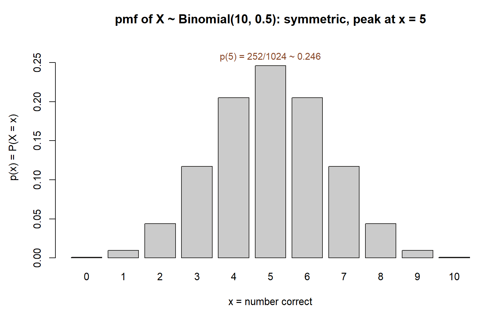

## The week question

Last week you learned to count outcomes: how many ways the chips can land, how many ways a hand can be
dealt, how many ways to get exactly $k$ correct on a quiz. Counting tells you *how many* outcomes there are
and *how likely* each one is, but it leaves the answer scattered across a list of possibilities. This week
we ask a tidier question.

**When the thing we actually care about is a number — a count, a total, a score — how do we package the
whole probability picture for that number in one place?**

The answer is the *random variable*. A random variable does one simple, powerful thing: it attaches a number
to each outcome of an experiment. Once outcomes become numbers, we can line them up on a number line, ask
"what is the probability the number equals 3?", and collect every such answer into a single object called a
*probability mass function*. By the end of the week you should be able to take a chance experiment, define a
random variable for it, write down its pmf, and read off probabilities of the form "exactly this many" and
"this many or fewer."

## Why this matters

Almost every probability question a person actually asks in the wild is about a *number*: how many shuttles
will be late this week, how many of the ten quiz questions you will get right, how many heads in a handful
of coin flips, how long until the next bus. The random variable is the bridge between the messy list of
outcomes you built in Weeks 1 through 6 and the numeric questions that come next.

It also sets up everything that follows. Once a number has a probability distribution, you can ask for its
*average* (Week 8, expectation) and its *spread* (Week 8, variance). You can notice that many different
experiments share the *same* distribution and give it a name (Week 9, the binomial and Poisson; Weeks 10–11,
the continuous models). The pmf you meet this week is the discrete ancestor of the density curve you will
meet for continuous quantities. Getting comfortable now with "outcome in, number out, probability attached"
makes the rest of the course feel like variations on one idea rather than a parade of new ones.

This week also sits at a natural checkpoint. We have finished building the discrete-probability toolkit, so
it is a good moment to consolidate before the course turns toward averages, named models, and continuous
quantities. See **Looking ahead** for how that checkpoint frames your studying.

## Learning goals

By the end of this week you should be able to:

- Define a **discrete random variable** as a rule that assigns a number to each outcome of an experiment.
- Write the **probability mass function** $p(x)=P(X=x)$ for a simple experiment and check that it is a valid
  pmf (each value in $[0,1]$, and all values summing to $1$).
- Build and read the **cumulative distribution function** $F(x)=P(X\le x)$ from a pmf.
- Translate a plain-language question ("at least 8 correct", "fewer than 2 heads") into a statement about
  $X$ and evaluate it from the pmf or cdf.
- Distinguish a random variable $X$ (the rule / the capital letter) from a particular value $x$ (a number it
  can take), and read $p(x)$ and $P(X=x)$ as two names for the same thing.

## Core vocabulary

- **Random variable** $X$ — a rule that assigns a real number to every outcome $\omega$ in the sample space
  $\Omega$. We write random variables with capital letters; the values they take are lowercase $x$.
- **Discrete random variable** — a random variable whose possible values form a list you can write out
  (finite, like $0,1,\dots,10$, or a countable sequence). This week is entirely about the discrete kind.
- **Support** — the set of values $x$ for which $p(x)>0$; the numbers $X$ can actually take.
- **Probability mass function (pmf)** $p(x)=P(X=x)$ — the function that reports the probability that $X$
  equals each value $x$. Sometimes written $p_X(x)$ when we need to say *which* variable. A valid pmf has
  $0\le p(x)\le 1$ for every $x$ and $\sum_x p(x)=1$.
- **Cumulative distribution function (cdf)** $F(x)=P(X\le x)$ — the running total of the pmf: the probability
  that $X$ is at most $x$. It climbs from $0$ up to $1$ as $x$ moves left to right.
- **Distribution** — the whole package: the support together with the probabilities attached to it. The pmf
  (or the cdf) *is* the distribution of a discrete random variable.

## Concept development

### From outcomes to numbers

Up to now an outcome has been a thing — a "heads," a "rain-then-late morning," a particular pattern of right
and wrong quiz answers. A random variable is the small, deliberate act of replacing each such thing with a
number we care about.

Formally, a random variable $X$ is a function from the sample space to the real numbers: feed it an outcome
$\omega$, and it returns a number $X(\omega)$. That sounds abstract, but the move is one you make
instinctively. Flip three coins and you might not care about the exact pattern HTH versus THH; you care that
*two heads* came up. The phrase "number of heads" *is* a random variable: it takes each three-flip outcome
and returns $0$, $1$, $2$, or $3$.

The point of the function is that it lets several different outcomes collapse onto the same number. Both HTH
and THH and HHT return the value $2$. That is exactly what we want: the number of heads does not care which
particular pattern produced it. The probabilities of those outcomes then *pile up* on the value $2$, and that
pile is what the pmf records.

### The probability mass function

Once $X$ turns outcomes into numbers, we can ask a clean question for each possible value: *what is the
probability that $X$ equals this number?* The function that answers it for every value at once is the
probability mass function,

$$
p(x) = P(X = x).
$$

Read it as "the probability mass sitting at the value $x$." For a discrete variable, all of the probability
in the experiment gets distributed — as discrete lumps — onto the values in the support. To find $p(x)$ you
gather every outcome that $X$ sends to $x$ and add up their probabilities:

$$
p(x) = P(X = x) = \sum_{\omega : X(\omega) = x} P(\{\omega\}).
$$

Two conditions make a function a *legitimate* pmf, and they are worth checking every time you write one
down. First, no value can carry negative or impossible probability:

$$
0 \le p(x) \le 1 \quad \text{for every } x.
$$

Second, the masses must account for *all* of the probability — the experiment certainly produces *some*
value — so they sum to one over the support:

$$
\sum_{x} p(x) = 1.
$$

If a pmf you have written fails the sum-to-one check, you have either missed a value or mis-counted one;
the check is your first line of defense against an arithmetic slip.

A small but important notation note from the course ledger: for a discrete random variable, $p(x)$ and
$P(X=x)$ are simply two names for the same number. We use $p(x)$ when we want to emphasize the *function*
(the whole table of probabilities) and $P(X=x)$ when we want to emphasize a *single* probability we are
computing. Do not let the two notations make you think they are different objects.

{#fig-wk07-pmf fig-alt="A symmetric bar chart of probabilities for x from 0 to 10. The bars rise to a peak at x = 5 of about 0.246 and fall away symmetrically to near zero at 0 and 10."}

::: {.callout-note appearance="minimal"}
**What the figure shows (non-visual equivalent).** Each bar is the mass $p(x) = \binom{10}{x}(0.5)^{10}$. The
most likely value is $5$, with $p(5) = 252/1024 \approx 0.246$; the bars are symmetric and the masses sum to
$1$. *Synthetic instructional example; numbers are illustrative.* (We build this quiz pmf in the worked example
below.)
:::

### The cumulative distribution function

The pmf answers "exactly this value." Many real questions instead ask "this value *or fewer*": at most two
late shuttles, fewer than five correct, no more than one defect. For these we accumulate the pmf from the
bottom up. The cumulative distribution function is

$$
F(x) = P(X \le x) = \sum_{t \le x} p(t),
$$

the total probability mass at or below $x$. Because we are piling up non-negative lumps as $x$ increases,
$F$ has three features that hold for *every* discrete random variable:

- It starts at $0$ (below the smallest value, no mass has accumulated) and ends at $1$ (above the largest
  value, all the mass is in).
- It never decreases as $x$ moves right — adding more lumps can only keep the total the same or raise it.
- For a discrete variable it is a **step function**: flat between the support values, jumping up by exactly
  $p(x)$ at each value $x$. The size of each jump *is* the pmf at that point, which means you can recover the
  pmf from the cdf and vice versa.

The cdf earns its keep on "tail" questions. The probability of "more than $a$" is the complement of "at most
$a$":

$$
P(X > a) = 1 - F(a),
$$

and the probability of landing in a block of values is a difference of cdf values,

$$
P(a < X \le b) = F(b) - F(a).
$$

Be careful with the boundary: $P(X \ge a)$ for an integer-valued variable is $1 - F(a-1)$, not $1-F(a)$,
because $F(a)$ already includes the mass *at* $a$. That one-step boundary care is the most common place a
correct pmf still yields a wrong tail probability.

{#fig-wk07-cdf-step fig-alt="A step function starting at 0, jumping up at each integer from 0 to 10, reaching 1 at x = 10. A dashed guide marks F(2) at about 0.0547. A tallest jump occurs at x = 5."}

::: {.callout-note appearance="minimal"}
**What the figure shows (non-visual equivalent).** Each dot is $F(x)$ at an integer $x$; the flat segment
after it is $F$ holding steady until the next jump. The jump size at each $x$ equals $p(x)$ — the biggest
jump is at $x=5$, matching the tallest bar in the pmf figure above. The dashed guide marks
$F(2)\approx 0.0547$, a value we compute exactly in the worked example below. *Synthetic instructional example; numbers are illustrative.*
:::

## Worked examples

Each example moves from the symbolic pmf to specific numbers. The data are synthetic; seed 35003 is set for
any simulation a student might run.

### Worked example — the quiz, as a random variable (recurring case)

Throughout the course we follow **Maya**, a commuter student. Last week we counted her ten-question true/false
quiz: with pure guessing, each question is right with probability $0.5$, the $2^{10}=1024$ answer keys are
equally likely, and the number of keys giving exactly $k$ correct answers is $\binom{10}{k}$. This week we
name the quantity she actually cares about and package it.

**Define the random variable.** Let

$$
X = \text{the number of the ten questions Maya gets correct by guessing.}
$$

Each outcome of the experiment is one full answer key (one of the $1024$ equally likely right/wrong
patterns); $X$ sends each key to its count of correct answers. The support is $0,1,2,\dots,10$.

**Build the pmf symbolically.** All $1024$ keys are equally likely, and $\binom{10}{x}$ of them have exactly
$x$ correct. So the probability mass at $x$ is the fraction of keys that hit $x$:

$$
p(x) = P(X = x) = \frac{\binom{10}{x}}{2^{10}} = \binom{10}{x}\left(\tfrac{1}{2}\right)^{10},
\qquad x = 0,1,2,\dots,10.
$$

(You will meet this exact shape again in Week 9 under its proper name, the binomial pmf. For now it is just
"equally likely keys, counted.")

**Put numbers on it.** Since $(1/2)^{10} = 1/1024$, the pmf is each binomial coefficient over $1024$. The
coefficients across the row are $1,10,45,120,210,252,210,120,45,10,1$ — symmetric, because guessing has no
bias toward right or wrong. Reading off a few values:

| $x$ | $\binom{10}{x}$ | $p(x)=P(X=x)$ |
|----:|----------------:|--------------:|
| 0 | 1 | $1/1024\approx 0.001$ |
| 1 | 10 | $10/1024\approx 0.010$ |
| 2 | 45 | $45/1024\approx 0.044$ |
| 5 | 252 | $252/1024\approx 0.246$ |
| 8 | 45 | $45/1024\approx 0.044$ |
| 9 | 10 | $10/1024\approx 0.010$ |
| 10 | 1 | $1/1024\approx 0.001$ |

The masses are largest in the middle, around $x=5$ — which already hints that pure guessing tends to land
near half-right, the average we will pin down precisely in Week 8.

**Check the pmf.** Every value is between $0$ and $1$, and the coefficients sum to $1+10+45+120+210+252+
210+120+45+10+1 = 1024$, so

$$
\sum_{x=0}^{10} p(x) = \frac{1024}{1024} = 1. \checkmark
$$

**Read the cdf for a tail question.** Suppose Maya wants the probability she scores *at most* $2$ correct.
That is a cdf value:

$$
F(2) = P(X \le 2) = p(0)+p(1)+p(2) = \frac{1+10+45}{1024} = \frac{56}{1024} \approx 0.0547.
$$

And the complementary "she gets at least $8$ correct" question reads off the symmetric upper tail:

$$
P(X \ge 8) = p(8)+p(9)+p(10) = \frac{45+10+1}{1024} = \frac{56}{1024} \approx 0.0547,
$$

equal to the lower tail because the distribution is symmetric. (We revisit exactly this $P(X\ge 8)\approx
0.0547$ in Week 9 once the variable wears its binomial name.) Notice the boundary care from the concept
section: "$X\ge 8$" is $1-F(7)$, *not* $1-F(8)$.

{#fig-wk07-tail-shade fig-alt="A symmetric bar chart of the quiz pmf from 0 to 10, with the bars at 0, 1, 2 shaded one color and the bars at 8, 9, 10 shaded a second color; both shaded groups are visibly the same total height."}

::: {.callout-note appearance="minimal"}
**What the figure shows (non-visual equivalent).** The lower shaded group is $p(0)+p(1)+p(2)=F(2)$; the
upper shaded group is $p(8)+p(9)+p(10)=P(X\ge 8)$. Both sum to $56/1024\approx 0.0547$ — the picture is the
symmetry argument made visible, the same fact the table above computes in numbers. *Synthetic instructional example; numbers are illustrative.*
:::

So the move this week is not new probability — it is repackaging. The counting you did in Week 6 *is* the
pmf; the random variable just gives the count a name and a number line to live on.

### Worked example — number of heads in three coin flips (transfer)

Now carry the same machinery to a fresh, smaller experiment so the pattern stands on its own. Flip a fair
coin three times and let

$$
X = \text{the number of heads in three flips.}
$$

**Symbolic setup.** The sample space is the eight equally likely flip patterns,
$\{\text{HHH}, \text{HHT}, \text{HTH}, \text{THH}, \text{HTT}, \text{THT}, \text{TTH}, \text{TTT}\}$, each of
probability $1/8$. The random variable $X$ counts the heads in each pattern, so its support is
$\{0,1,2,3\}$. The mass at $x$ is the number of patterns with exactly $x$ heads, divided by $8$:

$$
p(x) = P(X = x) = \frac{\binom{3}{x}}{2^{3}} = \frac{\binom{3}{x}}{8}, \qquad x = 0,1,2,3.
$$

**Numeric pmf.** The coefficients $\binom{3}{0},\binom{3}{1},\binom{3}{2},\binom{3}{3}$ are $1,3,3,1$, so
the pmf is the tidy table

| $x$ | patterns | $p(x)$ |
|----:|---------:|-------:|
| 0 | TTT | $1/8 = 0.125$ |
| 1 | HTT, THT, TTH | $3/8 = 0.375$ |
| 2 | HHT, HTH, THH | $3/8 = 0.375$ |
| 3 | HHH | $1/8 = 0.125$ |

— the famous $\{1,3,3,1\}/8$. It passes both validity checks: every entry lies in $[0,1]$, and
$\tfrac{1}{8}+\tfrac{3}{8}+\tfrac{3}{8}+\tfrac{1}{8}=\tfrac{8}{8}=1$.

{#fig-wk07-coin-pmf fig-alt="A bar chart with four bars over x = 0, 1, 2, 3, heights 1/8, 3/8, 3/8, 1/8, symmetric with two equal tallest bars in the middle."}

::: {.callout-note appearance="minimal"}
**What the figure shows (non-visual equivalent).** The bars are exactly the table's four values,
$\{1,3,3,1\}/8$; the two middle bars ($x=1,2$) are tied for tallest, matching the transfer example's small
support. *Synthetic instructional example; numbers are illustrative.*
:::

**Build the cdf.** Accumulate the pmf from the left:

$$
F(0)=\tfrac{1}{8}=0.125,\quad F(1)=\tfrac{4}{8}=0.5,\quad F(2)=\tfrac{7}{8}=0.875,\quad F(3)=\tfrac{8}{8}=1.
$$

This is the step function of the concept section made concrete: it is $0$ below $0$, jumps to $0.125$ at
$x=0$, to $0.5$ at $x=1$, to $0.875$ at $x=2$, to $1$ at $x=3$, and stays flat between. Each jump height is
exactly the pmf value, so you could rebuild the table $\{1,3,3,1\}/8$ just by reading the jump sizes.

{#fig-wk07-coin-cdf fig-alt="A four-step staircase function labeled F(0)=0.125, F(1)=0.500, F(2)=0.875, F(3)=1.000, rising from left to right."}

::: {.callout-note appearance="minimal"}
**What the figure shows (non-visual equivalent).** Each labeled point is one of the four cdf values computed
above; the flat stretch after each point is $F$ holding steady until the next jump. *Synthetic instructional example; numbers are illustrative.*
:::

**Use it.** "At least two heads" is an upper-tail question:

$$
P(X \ge 2) = p(2) + p(3) = \tfrac{3}{8} + \tfrac{1}{8} = \tfrac{4}{8} = 0.5,
$$

or, via the cdf with the integer boundary, $P(X\ge 2) = 1 - F(1) = 1 - 0.5 = 0.5$. The two routes agree —
a quick way to catch a boundary slip.

The three-flip coin and the ten-question quiz are the *same idea* at two sizes: equally likely outcomes,
count what you care about, divide the counts by the total to get the pmf, accumulate to get the cdf. The only
difference is $\binom{3}{x}/8$ versus $\binom{10}{x}/1024$.

{#fig-wk07-comparison fig-alt="Two side-by-side bar charts: the left, four bars over 0 to 3, symmetric and peaked in the middle; the right, eleven bars over 0 to 10, symmetric and peaked at 5. Both have the same overall shape at different scales."}

::: {.callout-note appearance="minimal"}
**What the figure shows (non-visual equivalent).** Placed side by side, the two pmfs make the shared shape
obvious without needing to compare the tables line by line: both are symmetric and tallest at the middle of
their support ($x=1.5$-ish for the coin, $x=5$ for the quiz). This is the visual version of the sentence
above it. *Synthetic instructional example; numbers are illustrative.*
:::

If you want to *see* a pmf rather than only compute it, the chunk below shows how a student could simulate
many quizzes and compare the empirical proportions to $p(x)$. It is shown for teaching and not run in this
build; run it in your own R session.

```{r}
#| label: quiz-pmf-simulation
#| eval: false
set.seed(35003)
n_quizzes <- 100000
# each quiz: 10 true/false questions, guessed; count the correct ones
correct <- replicate(n_quizzes, sum(sample(c(0, 1), size = 10, replace = TRUE)))
empirical <- table(factor(correct, levels = 0:10)) / n_quizzes
theoretical <- choose(10, 0:10) / 2^10
round(rbind(empirical, theoretical), 3)   # the two rows should nearly match
```

## A common mistake

The mistake to watch for this week is **confusing the random variable $X$ with a value $x$ it can take, and
the related slip of mishandling the integer boundary in the cdf.**

The first half: $X$ is the *rule* — the capital letter, the whole machine that turns any outcome into a
number, with an entire distribution attached. A lowercase $x$ is one *specific number* it can land on.
Writing "$P(X)$" with no value is meaningless; you must say *which* value, as in $P(X=3)$, or *which* range,
as in $P(X\le 2)$. Likewise, $p(x)$ for a single $x$ is one probability, while the pmf as a whole is the
function across all $x$. Keep the capital/lowercase distinction crisp and most of the confusion evaporates.

The second half bites in tail probabilities. Because the cdf $F(x)=P(X\le x)$ *includes* the mass at $x$, the
two events "$X>a$" and "$X\ge a$" are not the same for an integer-valued variable. The correct complements
are $P(X>a)=1-F(a)$ but $P(X\ge a)=1-F(a-1)$. On the quiz, $P(X\ge 8)$ uses $1-F(7)$, giving the
$56/1024\approx 0.0547$ above; using $1-F(8)$ would wrongly drop the mass at $x=8$. When a tail probability
comes out "almost right but a little off," check this boundary first.

{#fig-wk07-boundary fig-alt="A zoomed step function of the quiz's cdf from x = 5 to 10, with two dashed horizontal guides labeled F(7) at about 0.9453 and F(8) at about 0.9893, and text stating the correct and wrong tail computations."}

::: {.callout-note appearance="minimal"}
**What the figure shows (non-visual equivalent).** $F(7)\approx 0.9453$ sits on the plateau just *before*
the jump at $x=8$; $F(8)\approx 0.9893$ sits just *after* it. Subtracting from $1$ the wrong one
($1-F(8)\approx 0.0107$) throws away exactly the mass at $x=8$ that "at least 8" is supposed to include; the
right subtraction ($1-F(7)\approx 0.0547$) matches $P(X\ge 8)$ from the worked example above. *Synthetic instructional example; numbers are illustrative.*
:::

## Low-stakes self-checks (ungraded)

These are for your own practice — nothing here is collected or graded.

1. For Maya's quiz, write $P(X=5)$ as a binomial coefficient over $1024$, then as a decimal. Is it the single
   largest value in the pmf? Why does symmetry make $p(4)=p(6)$?
2. Using the three-flip coin, confirm that the four pmf values sum to $1$, then state $P(X=1)$ in words ("the
   probability of exactly one head") and check it equals $3/8$.
3. From the coin cdf, compute $P(1 < X \le 3)$ as $F(3)-F(1)$. Does it match $p(2)+p(3)$ directly?
4. Explain in one sentence why $F(x)$ can never go *down* as $x$ increases. What would a decrease imply about
   some $p(x)$?
5. A small support: let $Y$ be the number of late shuttles Maya catches in two independent mornings, where
   each morning is late with probability $0.19$. Write the support of $Y$, and set up (do not finish) the pmf
   for $Y=0$, $Y=1$, $Y=2$ by counting the ways. (We will finish exactly this kind of pmf in Week 9.)

## Reading and source pointer

For this week's spine, read **Grinstead & Snell, Chapter 1 (Discrete probability distributions)** for the
definition of a random variable and its distribution, and **Chapter 5 (Important distributions)** for how a
specific counting pmf — like our quiz's $\binom{10}{x}(1/2)^{10}$ — gets recognized as a named distribution.
The free online text is at
<https://www.dartmouth.edu/~chance/teaching_aids/books_articles/probability_book/book.html>.

No MIT 18.05 pointer this week; the named-model and simulation strands where 18.05 is genuinely used arrive
in Weeks 9 and 13.

These notes are the course's own synthesis, grounded in but not copied from the sources.

## Public vs. graded

These notes, the examples, and the practice here are **public and ungraded** — study material only. No
graded prompts, answer keys, rubrics, point values, or due dates appear on this site. Graded checkpoints,
quizzes, homework, labs, the midterm, the project, and the final live in **Blackboard (the LMS)**, which is
authoritative for due dates, submissions, and grades. If this page and Blackboard ever disagree, follow
Blackboard.

As a preparation note only: this week sits at the course's midpoint, and the **midterm is Friday, October 9,
in class**, covering the first half of the term — the probability-model, sample-space, conditional-probability,
independence, Bayes, counting, and now random-variable material of Weeks 1 through 7 or so. Treat that purely
as orientation for how to pace your review. The official scope, format, timing, and everything that counts
toward your grade live in Blackboard, which is authoritative; nothing on this public page sets or changes any
graded contract.

## Looking ahead

You now have a random variable, its pmf, and its cdf — the full description of a discrete number's behavior.
**Week 8** asks the two summary questions every distribution invites: where is its *center* (the expectation
$E[X]=\sum_x x\,p(x)$) and how *spread out* is it (the variance $\operatorname{Var}(X)$ and standard
deviation $\sigma$)? We will compute both for exactly the quiz variable you built today and find its center
sits at $5$ and its spread at $2.5$ — confirming the "guessing lands near half-right" hunch from the pmf.
**Week 9** then notices that the quiz pmf, the coin pmf, and many others share one shape, gives that shape
its name — the **binomial** — and adds the **Poisson** for counts like shuttle arrivals. The "outcome in,
number out, probability attached" habit you build this week is the foundation for all of it.

## See also

- The notation glossary, for the capital-$X$-versus-lowercase-$x$ and $p(x)=P(X=x)$ conventions used above:
  [../resources/notation-glossary.qmd](../resources/notation-glossary.qmd).
- The distribution reference, for how this week's counting pmf becomes a named model:
  [../resources/distribution-reference.qmd](../resources/distribution-reference.qmd).
- Where the counting that powers this week's pmf was built:
  [week-06-counting-and-discrete-probability.qmd](week-06-counting-and-discrete-probability.qmd).
- Where the pmf's center and spread are computed next:
  [week-08-expectation-and-variance.qmd](week-08-expectation-and-variance.qmd).
- Where this pmf earns its name and the binomial/Poisson models arrive:
  [week-09-common-discrete-models.qmd](week-09-common-discrete-models.qmd).
- The course syllabus, for the term's structure and the authoritative pointer to Blackboard:
  [../syllabus.qmd](../syllabus.qmd).
