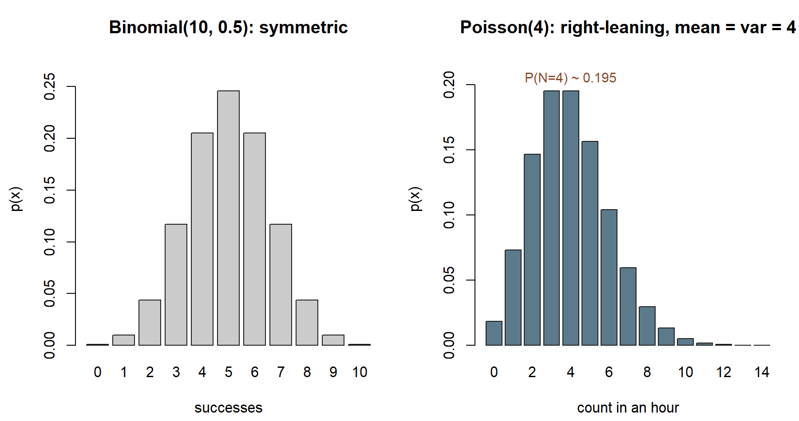

## The week question

Up to now you have built a random variable by hand: you listed the values it could take, attached a
probability to each, and read off the expectation and variance from that table. That works, but it is a lot
of bookkeeping, and it hides a useful fact — most of the discrete random variables you meet in practice are
not all different. They fall into a small number of recurring *shapes*, each with a name, a one-line story,
and a formula for its pmf, mean, and variance. Once you recognize the shape, you can skip the table entirely.

So this week's question is: **which named discrete model fits a given situation, and how do you read off its
probabilities once you have chosen it?** The skill is half modeling (matching a story to a model) and half
calculation (plugging into the model's pmf). We will work through four models that cover an enormous share of
first-course problems — Bernoulli, binomial, geometric, and Poisson — and we will keep checking the match
rather than reaching for a formula on autopilot.

## Why this matters

Naming a distribution is not vocabulary for its own sake. The payoff is that a name carries *everything* with
it. When you say "this is Binomial(10, 0.5)," you have committed to a specific pmf, a specific mean, a
specific variance, and a specific set of modeling assumptions — all at once, and all reusable. You no longer
re-derive the wheel for every quiz, every batch of parts, every hour of arrivals.

The matching itself is where the real reasoning lives. Each model is the answer to a *kind of question*:

- **How many successes in a fixed number of independent tries?** That is the binomial's question.
- **How long until the first success?** That is the geometric's question.
- **How many rare events land in a fixed window of time or space?** That is the Poisson's question.

Choosing the wrong model is the most common way a probability calculation goes wrong, and it never shows up
as an arithmetic error — the numbers will look perfectly reasonable. So the habit worth building this week is
to *say the assumptions out loud* before you compute. For Maya's commuter world, that means asking whether
her quiz guesses really are independent identical trials, and whether shuttle arrivals really do scatter at a
steady rate. When those assumptions hold, the named model is a gift; when they do not, the name is a trap.

## Learning goals

By the end of this week you should be able to:

- State the one-sentence story behind the Bernoulli, binomial, geometric, and Poisson models, and say what
  each one's parameter(s) mean.
- Decide *which* of these models fits a described situation, and name the assumption that would break the
  match.
- Write down the pmf for each model and evaluate a probability such as $P(X = k)$ or $P(X \ge k)$ from it.
- Read off the mean and variance of each model from its parameters without rebuilding a probability table.
- Recognize the Poisson as a model for counts of rare events in a fixed window — typos on a page, calls to a
  help desk, shuttles in an hour — and explain why mean equals variance there.

## Core vocabulary

- **Bernoulli trial** — a single trial with exactly two outcomes, "success" (probability $p$) and "failure"
  (probability $1-p$). The atom out of which the binomial and geometric are built.
- **Binomial model** — the count of successes in a *fixed* number $n$ of independent Bernoulli trials, each
  with the same success probability $p$. Written $X \sim \text{Binomial}(n, p)$.
- **Geometric model** — the number of trials *up to and including* the first success, in a sequence of
  independent Bernoulli($p$) trials. Written $X \sim \text{Geometric}(p)$, support $\{1, 2, 3, \dots\}$.
- **Poisson model** — the count of events in a fixed window of time, length, or area, when events occur at a
  steady average rate $\lambda$ and independently of one another. Written $N \sim \text{Poisson}(\lambda)$.
- **Rate / parameter $\lambda$** — for the Poisson, the mean number of events per window; it is *both* the
  mean and the variance.
- **Support** — the set of values a random variable can actually take. It differs by model: $\{0, 1\}$ for
  Bernoulli, $\{0, 1, \dots, n\}$ for binomial, $\{1, 2, \dots\}$ for geometric, $\{0, 1, 2, \dots\}$ for
  Poisson.

A convention note you will need all term: this course defines the **geometric as trials-until-success**, so
its smallest value is $1$, not $0$. (R's `rgeom` counts *failures before* the first success, so its smallest
value is $0$. Same idea, shifted by one — we flag this again in the lab and the distribution reference.)

## Concept development

### Bernoulli — the single yes/no trial

The simplest discrete model has just one trial and two outcomes. Code success as $1$ and failure as $0$, with

$$
p(1) = p, \qquad p(0) = 1 - p, \qquad 0 \le p \le 1.
$$

Its mean is $E[X] = p$ and its variance is $\text{Var}(X) = p(1-p)$, which you can confirm directly from the
two-row table. The Bernoulli is rarely the *final* answer to an interesting question, but it is the building
block: a single coin flip, a single quiz guess being right or wrong, a single shuttle being on time or late.
Everything else this week is built by stacking or timing Bernoulli trials. One on-time-or-late shuttle in
Maya's morning, taken in isolation, is a Bernoulli trial with $p = 0.81$ for "on time."

### Binomial — counting successes in a fixed number of tries

Now run $n$ independent Bernoulli($p$) trials and **count the successes**. The count $X$ ranges over
$\{0, 1, \dots, n\}$, and its pmf combines two ideas you have already met: the number of *ways* to place $x$
successes among $n$ trials, and the probability of *any one* such arrangement:

$$
p(x) = \binom{n}{x}\, p^{x}\, (1-p)^{\,n-x}, \qquad x = 0, 1, \dots, n.
$$

The $\binom{n}{x}$ counts arrangements (the same combinations you built in Week 6); the $p^{x}(1-p)^{n-x}$
gives each arrangement its probability because the trials are independent. The mean and variance follow from
adding up $n$ independent Bernoulli pieces:

$$
E[X] = n p, \qquad \text{Var}(X) = n p (1-p).
$$

The binomial fits when four things hold: a *fixed* number of trials, only two outcomes per trial, a
*constant* success probability, and *independence* across trials. Drop any one of these and the binomial
stops being the right model. If the number of trials is not fixed but you keep going until something happens,
you want the geometric instead.

### Geometric — waiting for the first success

Keep running independent Bernoulli($p$) trials, but now do not fix the count — stop the moment you get your
first success, and let $X$ be the trial number on which that success arrives. To land the first success
*exactly* on trial $x$, the first $x-1$ trials must all be failures and trial $x$ a success:

$$
p(x) = (1-p)^{\,x-1}\, p, \qquad x = 1, 2, 3, \dots
$$

The support starts at $1$ because at least one trial must occur. The mean has a clean and intuitive form,

$$
E[X] = \frac{1}{p},
$$

which says exactly what you would hope: if success has probability $p$, you wait on average $1/p$ trials for
it. Rare successes (small $p$) mean long waits. The geometric answers "how many tries until it works?", where
the binomial answers "how many of a fixed batch worked?" — same Bernoulli atoms, different question.

Picture this with Maya's own quiz-guessing probability $p = 0.5$, reframed as a *waiting* question instead of a
*counting* question: suppose she kept guessing, one question after another, until her first correct guess.
That reframing is exactly $\text{Geometric}(0.5)$.

{#fig-wk09-geometric-decay fig-alt="Bar chart of the Geometric(0.5) pmf over trial numbers 1 through 8, tallest at 1 (height 0.5) and shrinking by half at each subsequent trial, with a dashed vertical line at the mean of 2 trials."}

::: {.callout-note appearance="minimal"}
**What the figure shows (non-visual equivalent).** $p(1) = 0.5$, $p(2) = 0.25$, $p(3) = 0.125$, and so on —
each bar is half the height of the one before it. The mean wait is $E[X] = 1/p = 2$ trials, marked by the
dashed line. *Synthetic instructional example; numbers are illustrative.*
:::

### Poisson — counts of rare events in a fixed window

The Poisson model is different in flavor: there are no obvious individual "trials" to count. Instead you have
a continuous window — an hour, a page, a stretch of road — within which events happen at a steady average
rate, independently, and rarely on any tiny sub-interval. Let $N$ be the number of events in that window and
$\lambda$ the average count per window. Then

$$
p(x) = \frac{e^{-\lambda}\,\lambda^{x}}{x!}, \qquad x = 0, 1, 2, \dots
$$

The signature property is that the **mean and the variance are equal**:

$$
E[N] = \lambda, \qquad \text{Var}(N) = \lambda.
$$

That equality is a quick diagnostic. If you have count data whose spread is much larger than its average, the
Poisson assumption of independent, steady-rate events is probably violated (events may cluster). The Poisson
is the natural model for shuttle arrivals in an hour, typos on a page, calls reaching a help desk, or
particles registering on a counter — any setting where many opportunities each carry a small chance and you
care about the total. (Conceptually, it is the limit of a Binomial($n$, $p$) where $n$ grows large, $p$
shrinks, and the product $np = \lambda$ stays put. You can keep that picture in mind without proving it here.)

### Choosing among them

Before the words, here is the same decision path as a picture — the question to ask, and the three places it
can land:

{#fig-wk09-choose-flow fig-alt="A flowchart with one top box ('What are you counting?') branching by arrows into three boxes: fixed number of trials counting successes, trials until the first success, and events at a steady rate with no trials; each of these points down to its named model, Binomial (with Bernoulli as its n=1 case), Geometric, and Poisson."}

::: {.callout-note appearance="minimal"}
**What the figure shows (non-visual equivalent).** Three questions, three models: a fixed trial count with
successes counted is binomial (or Bernoulli when $n=1$); trials run until the first success is geometric;
events scattered at a steady rate with no discrete trials at all is Poisson. *Synthetic instructional example; numbers are illustrative.*
:::

A short decision path covers most cases. Ask first whether the number of trials is *fixed*. If yes and you
are counting successes, reach for the **binomial**; the single-trial case $n = 1$ is just the **Bernoulli**.
If instead you keep trying until the first success and count the *trial number*, that is the **geometric**. If
there are no discrete trials at all — just events scattered through a window at a steady rate — that is the
**Poisson**. The same data sometimes admits more than one framing, so the assumptions, not the surface story,
decide the model.

{#fig-wk09-models fig-alt="Two bar charts side by side. Left: Binomial(10, 0.5), symmetric, tallest at 5. Right: Poisson(4), right-leaning, tallest at 3 and 4 with a tail to the right, annotated P(N=4) about 0.195."}

::: {.callout-note appearance="minimal"}
**What the figure shows (non-visual equivalent).** The two shapes are visibly different even though both are
discrete: the binomial is symmetric (peak at $5$); the Poisson leans right (peak near $3$–$4$, a long right
tail). For the quiz, $P(X \ge 8) \approx 0.0547$; for arrivals, $P(N = 4) \approx 0.195$. The shape follows
from the *assumptions* — a fixed number of trials versus events at a steady rate — not the surface story.
*Synthetic instructional example; numbers are illustrative.*
:::

## Worked examples

All numbers below are **synthetic; seed 35003 is set** for any simulation. We re-use Maya's commuter world
for the recurring slice and then transfer the Poisson idea to a fresh context.

### Worked example — the quiz score as a binomial (recurring slice)

Maya faces a 10-question true/false quiz and guesses purely at random, so each answer is right with
probability $p = 0.5$, independently of the others. Let $X$ be the number she gets correct.

**Symbolic.** Ten independent two-outcome trials with constant success probability is exactly the binomial
setting, so

$$
X \sim \text{Binomial}(10,\, 0.5), \qquad p(x) = \binom{10}{x}(0.5)^{x}(0.5)^{10-x} = \binom{10}{x}(0.5)^{10}.
$$

Because $p = 0.5$, every arrangement carries the same factor $(0.5)^{10} = 1/1024$, so a probability is just
"(number of favorable arrangements) $/\, 1024$." The mean and variance come straight from the parameters:

$$
E[X] = n p = 10(0.5) = 5, \qquad \text{Var}(X) = n p (1-p) = 10(0.5)(0.5) = 2.5,
\qquad \sigma = \sqrt{2.5} \approx 1.58.
$$

**Numeric.** Suppose we want the probability she scores at least $8$ out of $10$ by luck alone — that is,
$P(X \ge 8)$. Sum the top three terms:

$$
P(X \ge 8) = p(8) + p(9) + p(10)
= \frac{\binom{10}{8} + \binom{10}{9} + \binom{10}{10}}{1024}
= \frac{45 + 10 + 1}{1024} = \frac{56}{1024} \approx 0.0547.
$$

So a pure guesser clears an 8-out-of-10 bar only about $5.5\%$ of the time. The mean of $5$ and standard
deviation of about $1.58$ say a score of $8$ sits roughly two standard deviations above what guessing
produces — unusual, but not astronomically so. This is the same quiz thread you saw build across Weeks 6–8;
the named model just lets you read mean, variance, and tail probabilities off the parameters directly.

{#fig-wk09-quiz-tail fig-alt="Bar chart of the Binomial(10, 0.5) pmf over 0 through 10, symmetric and tallest at 5, with the bars at 8, 9, and 10 highlighted and their sum labeled as 56/1024, approximately 0.0547."}

::: {.callout-note appearance="minimal"}
**What the figure shows (non-visual equivalent).** $P(X \ge 8)$ is not a separate calculation from the pmf —
it is literally the combined height of the three rightmost bars, $p(8)+p(9)+p(10) = 56/1024 \approx 0.0547$.
*Synthetic instructional example; numbers are illustrative.*
:::

You can confirm the tail by simulation (shown as teaching; not executed in this build):

```{r}
#| label: binom-quiz-sim
#| eval: false
set.seed(35003)
n_sim <- 100000
# count "correct" answers in 10 independent fair guesses, repeated many times
scores <- rbinom(n_sim, size = 10, prob = 0.5)
mean(scores)        # close to 5
var(scores)         # close to 2.5
mean(scores >= 8)   # close to 0.0547
```

### Worked example — shuttle arrivals as a Poisson count (recurring slice)

Shuttles serving Maya's stop arrive at a steady average rate of one every 15 minutes, which is **four per
hour**, and arrivals do not coordinate with one another. Let $N$ be the number that arrive in a given hour.

**Symbolic.** A count of independent, steady-rate events in a fixed window is the Poisson setting, with rate
$\lambda = 4$ per hour:

$$
N \sim \text{Poisson}(4), \qquad p(x) = \frac{e^{-4}\, 4^{x}}{x!}, \qquad x = 0, 1, 2, \dots
$$

Because mean equals variance for a Poisson,

$$
E[N] = \lambda = 4, \qquad \text{Var}(N) = \lambda = 4, \qquad \sigma = 2.
$$

**Numeric.** The probability that exactly four shuttles arrive in the hour is

$$
P(N = 4) = \frac{e^{-4}\, 4^{4}}{4!} = \frac{e^{-4}\,(256)}{24} \approx 0.195.
$$

So even though four per hour is the *average*, getting exactly four in any particular hour happens only about
$19.5\%$ of the time — the rest of the probability spreads over three, five, two, six, and so on. That spread
is the variance of $4$ at work, and it is why "on average four" does not mean "four every hour." (As a quick
sanity check on the model choice: if you logged arrivals for many hours and found the variance was, say,
$10$ while the mean stayed near $4$, the steady-independent-rate assumption would be suspect and the Poisson
would be the wrong model.)

{#fig-wk09-poisson-highlight fig-alt="Bar chart of the Poisson(4) pmf over counts 0 through 14, right-leaning with a peak near 3-4, with the bar at exactly 4 highlighted and labeled 0.195."}

::: {.callout-note appearance="minimal"}
**What the figure shows (non-visual equivalent).** The bar at $x=4$ is the tallest single bar (height $\approx
0.195$), but the other thirteen bars together still hold about $80\%$ of the probability — "on average four"
describes the whole shape, not a promise about any one hour. *Synthetic instructional example; numbers are illustrative.*
:::

### Worked example — typos on a page (transfer)

Now move the Poisson idea to a brand-new setting to show it is about the *structure* of the problem, not
about shuttles. A careful copy editor finds that a particular manuscript averages $\lambda = 2$ typos per
page, with typos scattered independently and at a steady rate down the page. Let $M$ be the number of typos
on a randomly chosen page.

**Symbolic.** Counts of rare, independent, steady-rate events in a fixed window (here the window is one page)
give

$$
M \sim \text{Poisson}(2), \qquad p(x) = \frac{e^{-2}\, 2^{x}}{x!}, \qquad E[M] = \text{Var}(M) = 2.
$$

**Numeric.** The probability a page is *clean* — zero typos — is

$$
P(M = 0) = \frac{e^{-2}\, 2^{0}}{0!} = e^{-2} \approx 0.135,
$$

so only about $13.5\%$ of pages come out perfectly, even though the typical page has just two typos. The same
template fits the number of calls reaching a help desk in an hour, or emails in an inbox over a lunch break:
identify the window, estimate the average count $\lambda$ in that window, check the steady-independent-rate
story, and the whole pmf follows. **Synthetic; seed set.**

{#fig-wk09-typos-highlight fig-alt="Bar chart of the Poisson(2) pmf over counts 0 through 10, peaked at 1 and 2, with the bar at 0 highlighted and an arrow labeling it approximately 0.135."}

::: {.callout-note appearance="minimal"}
**What the figure shows (non-visual equivalent).** $P(M=0) = e^{-2} \approx 0.135$ is the leftmost bar's
height. Compared with the arrivals figure ($\lambda=4$), this Poisson($2$) shape sits further left and drops
off faster — the *same* pmf formula, a *different* rate, a visibly different shape. *Synthetic instructional example; numbers are illustrative.*
:::

## A common mistake

The classic Week-9 error is **matching the model to the surface story instead of the assumptions**, and the
binomial-versus-geometric mix-up is the usual form. Both are built from independent Bernoulli($p$) trials, so
a problem about "coin flips" or "quiz guesses" *feels* like it could be either. The deciding question is what
is *fixed* and what is *random*:

- If the **number of trials is fixed** ($n = 10$ quiz questions) and you count successes, it is **binomial**.
- If you **stop at the first success** and count the trial number, the count itself is random and it is
  **geometric**.

The same sequence of trial outcomes can be read either way, which is exactly why the mix-up happens:

{#fig-wk09-binom-geom-contrast fig-alt="Two panels showing the same ten-trial sequence of F and S outcomes. Left panel: all ten trials shown, with all four S trials highlighted and labeled X equals number of S's equals 4. Right panel: only the first three trials (up to and including the first S) are shown in color; the remaining seven trials are blanked out, labeled X equals trial number of first S equals 3."}

::: {.callout-note appearance="minimal"}
**What the figure shows (non-visual equivalent).** For the illustrative sequence F,F,S,F,S,F,S,F,F,S: read as
a binomial question ("how many S's in all 10 trials?") the answer is $X=4$; read as a geometric question ("on
which trial does the first S land?") the answer is $X=3$, and every trial after that first success is simply
irrelevant to the count. Same data, two different random variables, because the *question* — not the outcomes
themselves — decides the model. *Synthetic illustrative sequence, not simulated data.*
:::

A second, related slip is forgetting that this course's geometric **starts its support at $1$**, not $0$,
because at least one trial must happen before you can have a first success. If you reach for software and use
R's `rgeom`, remember it counts *failures before* the first success and so starts at $0$ — its values are
exactly one less than ours. Add one to line them up. The third slip is treating a Poisson's $\lambda$ as if
it were tied to a number of trials: there are no trials to count in a Poisson, only a rate and a window, and
the giveaway that you have a genuine Poisson (rather than a binomial in disguise) is that **mean and variance
come out equal**. When you find yourself about to plug numbers in, pause and name the model's assumptions
first; the arithmetic is almost never the part that goes wrong.

## Low-stakes self-checks (ungraded)

These are for your own practice — nothing here is collected or graded.

1. A multiple-choice section has $5$ questions, each guessed independently with success probability $0.25$.
   Which model fits the number correct, and what are its mean and variance? (Answer the *model* before you
   compute.)
2. For Maya's quiz, $X \sim \text{Binomial}(10, 0.5)$, explain in one sentence why $P(X \ge 8)$ uses only the
   three terms $x = 8, 9, 10$, and confirm the numerator $45 + 10 + 1 = 56$ from the combinations.
3. You keep rolling a fair die until the first six appears. Name the model for the roll number of that first
   six, give its parameter $p$, and state its mean number of rolls.
4. Help-desk calls arrive at a steady $\lambda = 3$ per hour, independently. What are the mean and variance
   of the hourly count, and what is $P(\text{exactly } 0 \text{ calls in an hour}) = e^{-3}$ to three
   decimals?
5. Without computing, decide which model fits each: (a) number of defective items in a shipment of $20$,
   each defective with probability $0.05$; (b) number of pages you read before hitting the first dog-eared
   page; (c) number of meteors you see in a one-hour sky watch. Justify each by naming the assumption that
   makes it fit.

## Reading and source pointer

For the discrete-model definitions and their pmfs, read **Grinstead & Snell, Chapter 5 — *Important
Distributions* (discrete part)**, which develops the binomial, geometric, and Poisson families and their
basic properties:
<https://www.dartmouth.edu/~chance/teaching_aids/books_articles/probability_book/book.html>.

This week also draws on the secondary course text. See **MIT OpenCourseWare 18.05** for its treatment of
discrete random variables, the probability mass function, and expectation — useful for a second pass on how a
named model's pmf gives you its mean and tail probabilities:
<https://ocw.mit.edu/courses/18-05-introduction-to-probability-and-statistics-spring-2022/>.

These notes are the course's own synthesis, grounded in but not copied from the sources.

## Public vs. graded

These notes, the examples, and the practice here are **public and ungraded** — study material only. No
graded prompts, answer keys, rubrics, point values, or due dates appear on this site. Graded
checkpoints, quizzes, homework, labs, the midterm, the project, and the final live in **Blackboard
(the LMS)**, which is authoritative for due dates, submissions, and grades. If this page and Blackboard
ever disagree, follow Blackboard.

## Looking ahead

Every model this week was **discrete**: the support was a list of separate values you could in principle
enumerate, and a single value could carry positive probability. Next week we cross into **continuous random
variables**, where a variable can land anywhere in an interval, no single point carries probability, and
probability becomes *area under a density*. Maya's thread carries us there naturally: instead of counting how
*many* shuttles arrive in an hour, we will ask how *long* she waits for the next one — a continuous quantity.
The Poisson count and the continuous waiting time turn out to be two sides of the same arrival process, which
is exactly what Weeks 10 and 11 will make precise.

## See also

- Companion lab — [Lab 9: Simulating discrete models](../labs/lab-09-simulating-discrete-models.qmd) —
  generate binomial, geometric, and Poisson draws and check the means, variances, and tail probabilities
  above by simulation.
- [Notation glossary](../resources/notation-glossary.qmd) — the binding symbols and the model
  parameterizations ($\text{Geometric}(p)$ as trials-until-success, $\text{Poisson}(\lambda)$ with mean $=$
  variance).
- [Distribution reference](../resources/distribution-reference.qmd) — a one-stop table of each model's pmf,
  mean, variance, support, and the R `*binom`/`*geom`/`*pois` functions (including the geometric support
  shift).
- [Week 7 — Discrete random variables](week-07-discrete-random-variables.qmd) — where the pmf and the quiz
  random variable were first built by hand.
- [Week 8 — Expectation and variance](week-08-expectation-and-variance.qmd) — where $E[X] = 5$ and
  $\text{Var}(X) = 2.5$ for the quiz were derived from the definition.
- [Week 10 — Continuous random variables](week-10-continuous-random-variables.qmd) — the next step, where
  probability becomes area under a density.
- [Course syllabus](../syllabus.qmd) — overall structure, schedule, and where graded work lives.
