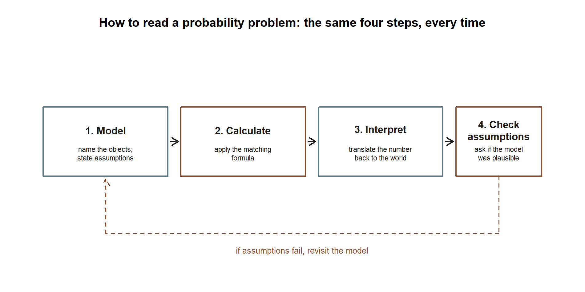

## The week question

We have spent fourteen weeks adding machinery one piece at a time, and each piece arrived wired to the same
small world: Maya's commuter morning. This last class is not for new tools. It is for stepping back far enough
to see that the tools were never separate — they were a single chain of reasoning that grew one link at a
time. So the question this week is the most useful one you can ask before a cumulative final: **when a
probability problem lands in front of you, how do you know which idea it is asking for, and how do the ideas
connect?**

The honest answer is that almost every problem in this course is one of a handful of moves — describe the
randomness, condition on what you know, update a belief, count or model the variable, summarize it with a
mean and spread, fit a named distribution, or take a limit — and the whole term has been those moves applied
to one running story. If you can re-walk Maya's morning end to end and name the move at each step, you can
read almost any first-course probability problem. That re-walk is what this page is.

## Why this matters

A final exam tempts you to memorize formulas. That is the wrong instinct, and this course was built to push
back on it. The reason naming a distribution mattered in Week 9, or stating an assumption out loud mattered in
Week 4, is that **the hard part of a probability problem is almost never the arithmetic** — it is deciding
what kind of object you are holding. Is "rain this morning" an event or a random variable? Is the question
asking for a marginal probability, a conditional one, or an updated one? Is the wait time discrete or
continuous? Get those choices right and the formula is the easy part; get them wrong and a perfectly clean
calculation answers the wrong question.

So the payoff of a synthesis week is a *reading skill*. By the end of it you should be able to look at a
problem, sort it into the right corner of the course in a sentence or two, and only then reach for a formula.
That skill is also exactly what carries past this class — into statistics, into any modeling you do later, and
into everyday reasoning about base rates and risk. The commuter thread is the scaffold we hang it on, but the
skill is the point.

## Learning goals

By the end of this synthesis you should be able to:

- Re-tell Maya's commuter morning as one connected chain, naming the probability idea at each link.
- Sort a new probability question into the right move — marginal, conditional, Bayes, counting, discrete or
  continuous random variable, expectation/variance, named model, joint/dependence, or a limit theorem.
- Recall the term's load-bearing numbers and say what each one *means*, not just what it equals.
- Apply a short "how to read a probability problem" checklist — model, calculate, interpret, check
  assumptions — to a problem you have not seen before.
- Use both course texts and the four labs as review aids, knowing which one helps with which strand.

## Core vocabulary

This week's vocabulary is the whole course, so instead of new terms, here are the *moves* the term taught,
each with the one-line question it answers:

- **Marginal probability** — "How likely is this event overall, before I know anything?" (Weeks 1–2.)
- **Conditional probability** — "How does that change once I know something else happened?" (Week 3.)
- **Independence** — "Does knowing one thing actually change the other, or not?" (Week 4.)
- **Bayes' rule / updating** — "Given an effect, how do I revise the probability of its cause?" (Week 5.)
- **Counting** — "How many equally likely arrangements are there?" (Week 6.)
- **Random variable, pmf, expectation, variance** — "What number does this experiment produce, and what is
  its center and spread?" (Weeks 7–8.)
- **Named model** — "Which standard distribution's story matches this one?" (Weeks 9, 11.)
- **Density and area** — "For a continuous quantity, what is the probability of a range?" (Weeks 10–11.)
- **Joint distribution, covariance, correlation** — "How do two random quantities move together?" (Week 12.)
- **Limit theorems (LLN, CLT)** — "What happens to an average as the sample grows?" (Week 13.)

## Concept development

### One thread, end to end

Here is the whole term as a single walk through Maya's morning. Read it slowly; each arrow is a week.

It starts with **uncertainty and a marginal**. There is a $0.30$ chance of rain, the shuttle is more reliable
when it is dry, and combining those gives the headline number $P(\text{on time}) = 0.81$, so $P(\text{late}) =
0.19$. That single number was the whole point of Weeks 1–2: a probability is a summary of a described random
world.

Then Maya **learns something** and we **condition**. Looking out the window changes the problem: $P(\text{on
time} \mid \text{rain}) = 0.60$, not $0.81$. Conditioning is just restricting the world to the cases where
what you learned is true (Week 3).

That immediately raises **independence**: is "on time" unaffected by "rain"? No — $0.60 \ne 0.81$, so the two
are *dependent*, which is exactly what makes the morning interesting. A fair coin flip on the side would be
independent; the shuttle is not (Week 4).

Dependence makes **updating** possible. If Maya only learns she was *late*, she can run the arrow backward
with Bayes' rule and ask how likely rain was: $P(\text{rain} \mid \text{late}) \approx 0.632$. The same
machinery, applied to a medical screening test, produces the term's most memorable surprise — a positive test
for a rare condition still leaves the posterior near $0.162$, because base rates dominate (Week 5).

To handle questions with many equally likely arrangements, we needed **counting**: a 10-question true/false
quiz has $2^{10} = 1024$ possible answer keys, and $\binom{10}{k}$ of them have exactly $k$ correct (Week 6).

Counting turned the quiz into a **random variable** $X$ = number correct, with a pmf, and then a center and
spread: $E[X] = 5$, $\operatorname{Var}(X) = 2.5$, $\sigma \approx 1.58$ (Weeks 7–8).

That random variable had a name. $X \sim \text{Binomial}(10, 0.5)$, and the arrivals at Maya's stop are
$\text{Poisson}(4)$ per hour — **named discrete models** carry their mean, variance, and pmf with them
(Week 9).

Asking *how long* she waits, rather than *how many* arrive, pushed us into the **continuous** world, where
probability is *area under a density*: the wait is $\text{Exponential}$ with mean $15$ minutes, and her
commute time is $\text{Normal}(22, 5)$ with $P(C \le 30) \approx 0.945$ (Weeks 10–11).

Two of these quantities move together, so we built a **joint distribution** for (rain, late) and measured the
dependence we first spotted in Week 4 as a number: $\operatorname{Cov} = 0.063$, $\rho \approx 0.35$
(Week 12).

Finally, averaging many days of commute brought the **limit theorems**: the sample mean settles toward the
true mean $22$ (LLN), and the average of $n$ days is approximately $\text{Normal}(22, 5/\sqrt{n})$ (CLT,
Week 13).

That is the entire course in one paragraph-per-week. Every formula you learned was one link in this chain.
Seeing the whole chain as a single picture makes the "one link at a time" claim concrete:

{#fig-wk15-course-map fig-alt="A flow diagram of ten boxes in two rows of five, connected by arrows left to right and wrapping from the end of the top row down to the start of the bottom row. Top row: Marginal, Conditional, Independence, Bayes/updating, Counting. Bottom row: Random variable/expectation/variance, Named model, Density/area, Joint/covariance, Limits (LLN, CLT)."}

::: {.callout-note appearance="minimal"}
**What the figure shows (non-visual equivalent).** Ten labeled boxes in reading order: Marginal (Wk 1–2),
Conditional (Wk 3), Independence (Wk 4), Bayes/updating (Wk 5), Counting (Wk 6), Random variable/expectation/
variance (Wk 7–8), Named model (Wk 9), Density/area (Wk 10–11), Joint/covariance (Wk 12), Limits: LLN and CLT
(Wk 13). An arrow connects each box to the next, including the wrap from Counting down to Random variable —
the same order the paragraphs above just walked. *Synthetic instructional example; numbers are illustrative.*
:::

### The term's load-bearing numbers (and what they mean)

A final rewards *understanding* the key numbers, not just listing them. Here are the term's anchors with their
meaning attached, in the same order as the chain above — read the table as a ladder, each row one rung past
the row before it. All are **synthetic; seed 35003 is set** for any simulation.

| Number | Where | What it *means* |
|---|---|---|
| $0.81 \,/\, 0.19$ | Wk 1–2 | overall chance the shuttle is on time / late, before you look outside |
| $0.60$ | Wk 3 | on-time chance *given* it is raining — conditioning lowers it from $0.81$ |
| not independent | Wk 4 | $0.60 \ne 0.81$, so rain and lateness carry information about each other |
| $0.632$ | Wk 5 | $P(\text{rain} \mid \text{late})$ — updating *backward* from effect to cause |
| $0.162$ | Wk 5 | screening posterior $P(D \mid +)$ — a rare base rate survives a positive test |
| $1024,\ \binom{10}{k}$ | Wk 6 | total answer keys and the count with exactly $k$ correct |
| $E = 5,\ \operatorname{Var} = 2.5$ | Wk 7–8 | center and spread of the guessed quiz score |
| $\text{Poisson}(4)$ | Wk 9 | arrivals per hour; mean $=$ variance $= 4$ |
| mean $15$ min | Wk 11 | exponential wait for the next shuttle |
| $0.945$ | Wk 11 | $P(C \le 30)$ for a $\text{Normal}(22, 5)$ commute |
| $0.063,\ \rho \approx 0.35$ | Wk 12 | covariance and correlation of rain and lateness — Week 4's "dependent," now numeric |
| $\to 22$ | Wk 13 | the long-run average commute the LLN drives toward |

: The term's load-bearing numbers and what they mean, in the same order as the chain above -- the numeric companion to the course-map diagram above. {#tbl-wk15-numbers-ladder}

If you can say the *meaning* column out loud for each row, you understand the course. The equals signs are the
easy part.

### How to read a probability problem (the checklist)

The single most transferable thing this course can hand you is a way to *start* any problem. Four steps, in
order:

1. **Model.** Name the objects. Is each quantity an event or a random variable? Discrete or continuous? What
   sample space, or what distribution? Write the assumptions down — independence, a fixed number of trials, a
   steady rate — *before* you compute. Most wrong answers are wrong here, not in the arithmetic.
2. **Calculate.** Now reach for the matching formula: an addition or multiplication rule, a conditional ratio,
   Bayes' rule, a pmf or density, an expectation sum or integral, a named model's mean and variance, or a
   limit theorem. The model from Step 1 tells you which one.
3. **Interpret.** Translate the number back into the world. "About $5.5\%$" or "the posterior is only $0.162$"
   — say what it *means* for Maya, the patient, or the manuscript. A probability with no interpretation is
   half an answer.
4. **Check assumptions.** Ask whether the model you assumed is actually plausible. Are the trials really
   independent? Is the rate really steady? Does a Poisson's mean-equals-variance hold in the data? If the
   assumptions fail, the clean number is meaningless, and recognizing that is itself a correct answer.

{#fig-wk15-checklist fig-alt="A left-to-right flow diagram of four boxes: 1. Model, 2. Calculate, 3. Interpret, 4. Check assumptions, connected by solid arrows. A dashed arrow loops from box 4 back to box 1, labeled: if assumptions fail, revisit the model."}

::: {.callout-note appearance="minimal"}
**What the figure shows (non-visual equivalent).** Four boxes in a row — Model, Calculate, Interpret, Check
assumptions — each connected to the next by an arrow. A dashed arrow loops from the fourth box back to the
first, labeled "if assumptions fail, revisit the model," showing that a failed assumptions check sends you
back to naming the objects, not back to redoing the arithmetic. Both worked examples below use these same four
labels, in this order. *Synthetic instructional example; numbers are illustrative.*
:::

This is the same arc every concept week followed — describe, compute, interpret, sanity-check — compressed
into four words you can carry into the exam: **model, calculate, interpret, check.**

## Worked examples

This is a synthesis week, so we add no new transfer scenario — we re-walk the recurring slice and show the
checklist running on it. All numbers are **synthetic; seed 35003 set.**

### Worked example — one question, four moves on the recurring thread

Take a single composite question about Maya's morning and watch the checklist sort it. *"Maya was late this
morning. How surprised should she be, and how does that revise her guess that it rained?"*

**Model.** "Late" and "rain" are *events*, not random variables, so this is a conditioning-and-updating
problem, not a distribution problem. We have the marginals and the conditionals from the term: $P(\text{rain})
= 0.30$, $P(\text{late} \mid \text{rain}) = 0.40$, $P(\text{late} \mid \text{no rain}) = 0.10$. The move is
Bayes' rule.

**Calculate.** First the marginal chance of being late, by the law of total probability:

$$
P(\text{late}) = P(\text{late} \mid \text{rain})P(\text{rain}) + P(\text{late} \mid \text{no rain})P(\text{no rain})
= 0.40(0.30) + 0.10(0.70) = 0.19.
$$

Then run the arrow backward with Bayes' rule:

$$
P(\text{rain} \mid \text{late}) = \frac{P(\text{late} \mid \text{rain})\,P(\text{rain})}{P(\text{late})}
= \frac{0.40 \times 0.30}{0.19} = \frac{0.12}{0.19} \approx 0.632.
$$

**Interpret.** Being late is a $0.19$ event — uncommon but not rare, so it is mild evidence. Learning she was
late lifts the chance it rained from the prior $0.30$ up to about $0.632$ — better than even, because lateness
is much more likely on rainy mornings, but not a certainty, because dry mornings still occasionally run late.

{#fig-wk15-bayes-chain fig-alt="A three-bar chart. Left bar, prior P of rain equals 0.30. Middle bar, marginal P of late equals 0.19, shorter and gray. Right bar, posterior P of rain given late, about 0.632, more than double the prior bar height, with a dotted reference line at the prior's height for comparison."}

::: {.callout-note appearance="minimal"}
**What the figure shows (non-visual equivalent).** Three bars on the same $0$-to-$1$ probability scale: the
Model step's prior $P(\text{rain})=0.30$, the Calculate step's marginal $P(\text{late})=0.19$, and the
Calculate step's posterior $P(\text{rain}\mid\text{late})\approx 0.632$. A dotted line at the prior's height
shows the posterior bar rising to a bit more than double it — the same numbers this worked example already
derived, now shown as one chain instead of three separate lines of algebra. *Synthetic instructional example; numbers are illustrative.*
:::

**Check assumptions.** The whole calculation rests on those two conditional rates ($0.40$ and $0.10$) being
stable, and on rain being the only relevant cause of lateness. If a road closure or a missed alarm were also
in play, the model would be incomplete and the tidy $0.632$ would overstate the rain's role. Naming that limit
is part of the answer.

That is the entire reading skill in one example: the four steps did the work, and the formula appeared only
once we knew it was a Bayes problem.

### Worked example — the same morning as a random variable and a joint pair

The recurring thread also lives on the *random-variable* side, and a final may ask it that way. Code rain as
$X$ ($1$ if rain, $0$ if not) and late as $Y$ ($1$ if late, $0$ if not). The joint pmf we built in Week 12 is
$P(1,1) = 0.12$, $P(1,0) = 0.18$, $P(0,1) = 0.07$, $P(0,0) = 0.63$.

**Symbolic.** Covariance measures how the two move together,

$$
\operatorname{Cov}(X, Y) = E[XY] - E[X]\,E[Y],
\qquad
\rho = \frac{\operatorname{Cov}(X, Y)}{\sigma_X \, \sigma_Y}.
$$

**Numeric.** With $E[X] = 0.30$, $E[Y] = 0.19$, and $E[XY] = P(1,1) = 0.12$,

$$
\operatorname{Cov}(X, Y) = 0.12 - 0.30(0.19) = 0.063,
\qquad
\rho \approx \frac{0.063}{0.1798} \approx 0.35.
$$

{#fig-wk15-joint-grid fig-alt="A two-by-two shaded grid with rows rain equals 1 and rain equals 0, columns late equals 0 and late equals 1. Cell values: rain 1 late 0 is 0.18; rain 1 late 1 is 0.12, annotated that an independent world would give 0.057; rain 0 late 0 is 0.63, the darkest and largest cell; rain 0 late 1 is 0.07. Row totals 0.30 and 0.70; column totals 0.81 and 0.19."}

::: {.callout-note appearance="minimal"}
**What the figure shows (non-visual equivalent).** A $2\times2$ grid of the joint pmf: $P(1,1)=0.12$,
$P(1,0)=0.18$, $P(0,1)=0.07$, $P(0,0)=0.63$, with row totals $0.30/0.70$ and column totals $0.81/0.19$
matching the marginals. Darker shading marks a larger probability, so the $(0,0)$ cell (no rain, on time) is
darkest. The $(1,1)$ cell, $0.12$, is called out against the $0.057$ an independent world would produce
($P(\text{rain})\times P(\text{late}) = 0.30 \times 0.19$) — the joint pmf puts more than double the
independent weight on "rain and late together," the numeric fingerprint of the positive covariance computed
above. *Synthetic instructional example; numbers are illustrative.*
:::

**Interpret.** The positive covariance is the *number* behind Week 4's word "dependent": rain and lateness go
up together. And the consistency check ties the two halves of the course shut — from the joint pmf,
$P(\text{late} \mid \text{rain}) = 0.12 / 0.30 = 0.40$, exactly the conditional rate that drove the Bayes
calculation above. The event view and the random-variable view are the same world described twice.

## A common mistake

The signature synthesis-week error is **reaching for a formula before naming the object** — the exact thing
the checklist exists to prevent. Under exam pressure it is tempting to scan a problem for numbers and start
multiplying. That is how a marginal gets used where a conditional is needed, how a density value gets read as
a probability, or how the binomial gets fitted to a "wait until the first success" story that is really
geometric. None of these show up as arithmetic errors; the numbers look fine. They are *modeling* errors, and
they are caught only in Step 1.

{#fig-wk15-two-paths fig-alt="Two labeled paths. Top, wrong path: see numbers, start multiplying, leading to clean arithmetic that answers the wrong question. Bottom, right path: name the object as an event or random variable and pick the move, leading to the matching formula that answers the right question. Caption beneath both: same numbers, same arithmetic skill, different first move."}

::: {.callout-note appearance="minimal"}
**What the figure shows (non-visual equivalent).** Two parallel two-box paths. Top ("wrong path"): "see
numbers, start multiplying" leads to "clean arithmetic, wrong question answered." Bottom ("right path"): "name
the object: event or RV? which move?" leads to "matching formula, right question answered." Both paths use
the same arithmetic skill; only the first move differs, and that first move is exactly Step 1 of the
checklist above. *Synthetic instructional example; numbers are illustrative.*
:::

A second, related slip is **forgetting to interpret and sanity-check**. A bare number — "$0.162$" — is not a
finished answer; the finished answer is "even after a positive test, the condition is still unlikely, because
it is rare to begin with." And a number built on a broken assumption (independent trials that are actually
correlated, a steady rate that actually clusters) is worse than no number, because it looks authoritative. The
fix for both is the same discipline you practiced all term: model first, then calculate, then say what it
means, then ask whether you believe the model. Slow down at Steps 1 and 4 and the middle takes care of itself.

## Low-stakes self-checks (ungraded)

These are for your own review — nothing here is collected or graded. Try to name the *move* before you compute.

1. Walk Maya's morning from $P(\text{on time}) = 0.81$ all the way to the CLT, naming the week and the
   probability idea at each link, without looking at the thread above.
2. For each, say which move it is — marginal, conditional, Bayes, counting, expectation, named model,
   density/area, joint, or a limit theorem: (a) $P(\text{shuttle on time})$; (b) $P(\text{rain} \mid
   \text{late})$; (c) $P(C \le 30)$ for the commute; (d) $\rho$ between rain and lateness; (e) the average of
   $50$ commutes.
3. Recompute $P(\text{rain} \mid \text{late}) \approx 0.632$ from $P(\text{rain}) = 0.30$,
   $P(\text{late} \mid \text{rain}) = 0.40$, $P(\text{late} \mid \text{no rain}) = 0.10$, and explain in one
   sentence why the posterior rose above the prior.
4. State what each anchor number *means* (not just equals): $0.945$, $0.162$, $E[X] = 5$, $\rho \approx 0.35$,
   and "$\to 22$."
5. Pick any problem from any earlier week, and write the four checklist steps for it — model, calculate,
   interpret, check assumptions — in full sentences.

## Reading and source pointer

This is a review week, so point yourself at *both* course texts and skim broadly rather than deeply. For a
chapter-by-chapter re-walk of the whole term's spine — sample spaces and rules, conditional probability and
Bayes, counting, random variables, the standard discrete and continuous models, joint distributions, and the
limit theorems — return to **Grinstead & Snell**, reading the chapter that matches each week of the arc:
<https://www.dartmouth.edu/~chance/teaching_aids/books_articles/probability_book/book.html>.

For a *second* source of review and practice in a different voice, use the **MIT OpenCourseWare 18.05** review
materials and practice problems; working a few of its problems alongside your re-walk is a good way to test
whether the reading skill transfers off the commuter thread:
<https://ocw.mit.edu/courses/18-05-introduction-to-probability-and-statistics-spring-2022/>.

These notes are the course's own synthesis, grounded in but not copied from the sources.

## Public vs. graded

These notes, the examples, and the practice here are **public and ungraded** — study material only. No
graded prompts, answer keys, rubrics, point values, or due dates appear on this site. Graded
checkpoints, quizzes, homework, labs, the midterm, the project, and the final live in **Blackboard
(the LMS)**, which is authoritative for due dates, submissions, and grades. If this page and Blackboard
ever disagree, follow Blackboard.

## Looking ahead

The last class meets Monday, December 7; a consultation day follows, and the cumulative final lands in the
end-of-term window (the exact block is posted in Blackboard, which is authoritative — no date or block is
fixed on this page). What is "ahead" is really what is *next after this course*: every move you practiced here
is the foundation under statistical inference. The conditioning and updating of Week 5 grow into Bayesian
statistics; the expectation, variance, and named models become the building blocks of estimators; and the
limit theorems of Week 13 are the reason a sample mean can stand in for a population mean at all. You leave
with a reading skill — model, calculate, interpret, check — that outlasts every formula on the final.

## See also

- [Course syllabus](../syllabus.qmd) — the full schedule and where graded work, including the final, lives
  (Blackboard is authoritative for all dates and the exam block).
- [Notation glossary](../resources/notation-glossary.qmd) — every symbol and model parameterization the term
  used, in one place — the right thing to skim before the final.
- [Distribution reference](../resources/distribution-reference.qmd) — a one-stop table of each named model's
  pmf or density, mean, variance, and support, for the Week 9 and Week 11 strands.
- Review aids — the four simulation labs, each re-checking a piece of the thread by simulation:
  [Lab 2: Monte Carlo basics](../labs/lab-02-monte-carlo-basics.qmd),
  [Lab 5: Bayes by simulation](../labs/lab-05-bayes-by-simulation.qmd),
  [Lab 9: Simulating discrete models](../labs/lab-09-simulating-discrete-models.qmd), and
  [Lab 13: Law of large numbers and the CLT](../labs/lab-13-law-of-large-numbers-and-clt.qmd).
- [Week 1 — Uncertainty, probability & models](week-01-uncertainty-probability-models.qmd) — the start of the
  thread, where $P(\text{on time}) = 0.81$ first appeared.
- [Week 5 — Bayes' rule & updating](week-05-bayes-rule-and-updating.qmd) — the updating move at the heart of
  the recurring slice above.
- [Week 13 — Sums, simulation & limit behavior](week-13-sums-simulation-limit-behavior.qmd) — the final link
  in the chain, where averages settle toward $22$.
- [Week 14 — Probability modeling project](week-14-probability-modeling-project.qmd) — the project that put
  the whole arc to work just before this review.
